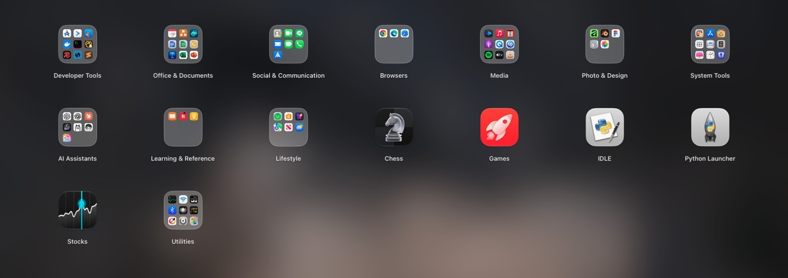
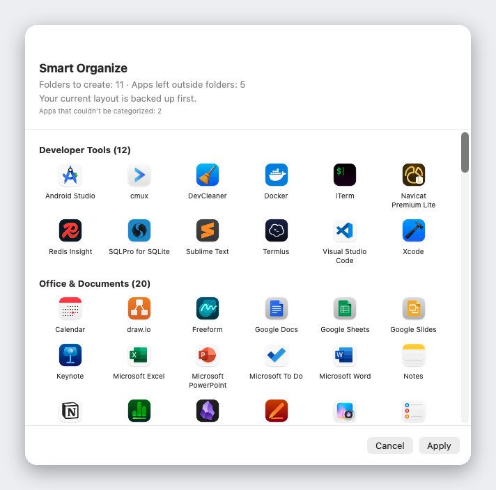

<div align="center">


# Liftoff

**The Launchpad that macOS 26 took away — back, faster, and with live window previews.**

[](LICENSE)


[](https://github.com/firstfu/Liftoff/releases/latest)

[](https://alternativeto.net/software/liftoff-by-firstfu/)

[Website](https://firstfu.github.io/Liftoff/) · [Download](https://github.com/firstfu/Liftoff/releases/latest) · [Features](#features) · [Install](#install) · [Privacy](#privacy) · [Translations](#languages)

English · [繁體中文](translations/README.zh-Hant.md) · [简体中文](translations/README.zh-Hans.md) · [日本語](translations/README.ja.md) · [한국어](translations/README.ko.md) · [Deutsch](translations/README.de.md) · [Français](translations/README.fr.md) · [Español](translations/README.es.md) · [Português](translations/README.pt-BR.md) · [Italiano](translations/README.it.md) · [Русский](translations/README.ru.md) · [Türkçe](translations/README.tr.md) · [Nederlands](translations/README.nl.md)

<a href="https://github.com/firstfu/Liftoff/releases/latest"><b>Download Liftoff.zip</b></a>
&nbsp;·&nbsp;
<code>brew install --cask firstfu/tap/liftoff</code>


</div>

> [!NOTE]
> Liftoff needs **macOS 26 or later**. It is **not notarized by Apple yet**, so macOS blocks the first launch: open System Settings → Privacy & Security and click **Open Anyway** once ([steps](#install)). All the code is here, and [what each permission is used for](#permissions-at-a-glance) is spelled out below.

## Why Liftoff

macOS 26 replaced the classic Launchpad grid with the "Apps" list. If you liked the grid — pages, folders, drag to rearrange, type to search — Liftoff gives it back, built from scratch for macOS 26 and held to hard performance limits: it opens in under 3 ms, never drops a frame while paging, and uses 0% CPU when idle.

Then it adds what the original never had.



## Features

### Live window previews

Rest the pointer on a running app (or press <kbd>Space</kbd> on it) and its windows appear as thumbnails. Click one to jump straight to that window — minimized windows and windows on other desktops included.


### Search that finds apps *and* windows

Type a few letters. Liftoff matches app names, initials (`vsc` → Visual Studio Code), pinyin for Chinese names, and the titles of your open windows.


### Smart Organize

One click sorts your whole app collection into sensible folders — Developer Tools, Documents & Office, Media, Utilities… You see a full preview first, nothing changes until you press Apply, and your current layout is backed up automatically.

It works from a built-in table of 1,000+ popular Mac apps (including apps popular in China, Japan, Korea and Taiwan), not from guesses: no AI, no network, the same result every time. Missing an app? It's one line in [`AppCategories.json`](Liftoff/Resources/AppCategories.json) — pull requests welcome.



### And more

- **Drag an app to the Dock** straight from the grid — the panel gets out of the way automatically
- **Import your old Launchpad layout**, or start fresh with Smart Organize
- Open it any way you like: hotkey (<kbd>⌃⌘L</kbd> by default), thumb-and-three-finger pinch, a hot corner, the Dock icon, or `open liftoff://toggle`
- Pages, folders (drag to merge), drag to reorder, keyboard navigation
- Blurred or sharp wallpaper (blurred uses the least power), live blur, built-in gradients and solid colors, or your own image; adjustable icon size, label size and colors
- Multi-display aware · hide apps · uninstall apps with leftovers · back up and restore your layout
- 13 languages, following your system language


## Performance

Measured on a real Mac by the app itself (`scripts/selftest.sh` reproduces the numbers on yours):

| | |
|---|---|
| Open the panel | **< 3 ms** |
| Search, per keystroke | **< 8 ms** |
| Paging | **0 dropped frames** |
| Idle | **0% CPU** |

## Privacy

Liftoff makes **no network connections** unless you ask it to check for updates. Window thumbnails are captured and shown locally and never leave your Mac.
The only connection it can make is the update check: one request to the GitHub API to read the latest version number, sent only when you click **Check for Updates…** or turn on **Check for updates weekly** in Settings (off by default). No data about you is sent.

Don't take my word for it: the code that uses each permission is in [`Liftoff/Preview`](Liftoff/Preview) (Screen Recording: thumbnails; Accessibility: listing and switching windows) and [`Liftoff/Services`](Liftoff/Services) (hotkey, hot corner, trackpad gesture, and the update check in `UpdateChecker.swift`). Little Snitch or LuLu will confirm it too.

### A note on private APIs

Two features use undocumented macOS APIs, both loaded dynamically with a fallback — if the symbols disappear the feature turns itself off instead of crashing:

- [`Liftoff/Preview/PrivateAPI.swift`](Liftoff/Preview/PrivateAPI.swift) — SkyLight / HIServices, for window enumeration and switching (the same approach as AltTab and Hammerspoon)
- [`Liftoff/Services/TrackpadGesture.swift`](Liftoff/Services/TrackpadGesture.swift) — MultitouchSupport, for the pinch gesture (the same approach as BetterTouchTool and MiddleClick)

## Install

**Homebrew** (a [personal tap](https://github.com/firstfu/homebrew-tap)): `brew install --cask firstfu/tap/liftoff`

**Or download manually:**

1. Download `Liftoff.zip` from [Releases](https://github.com/firstfu/Liftoff/releases/latest) and unzip it.
2. Move `Liftoff.app` to `/Applications`.
3. Open it. macOS will block it the first time, because it isn't notarized by Apple yet: open **System Settings → Privacy & Security**, scroll down, and click **Open Anyway** next to *"Liftoff" was blocked to protect your Mac.*
4. Grant the permissions it asks for: **Accessibility** (list and switch windows) and **Screen Recording** (window thumbnails, local only).

Requires **macOS 26 or later**, Apple silicon or Intel.

### Updating

Replace `Liftoff.app` in `/Applications` with the new one, or run `brew upgrade --cask liftoff` once the tap is updated. Since 1.2.1, releases are signed with the same certificate every time, so Screen Recording and Accessibility stay allowed after an update; you may still need to click **Open Anyway** once for the new version. Updating from 1.2.0 or earlier needs one last re-allow (if a switch looks on but does nothing, remove Liftoff from the list with **−** and add it back).
To hear about new versions: choose **Check for Updates…** in the menu bar menu or in Settings, turn on **Check for updates weekly** in Settings (off by default), or use **Watch → Custom → Releases** on this page.

## Permissions at a glance

| Permission | Needed? | Why | If you skip it |
|---|---|---|---|
| **Screen Recording** | Only for window previews | Window thumbnails and titles (captured and shown on your Mac only) | No window previews; Liftoff is still a launcher |
| **Accessibility** | Optional | List minimized windows and jump to exactly the window you clicked | Minimized windows aren't listed; switching is less precise |

Nothing else is requested. The launcher itself needs no permission at all.

## FAQ

<details>
<summary><b>macOS says "Liftoff was blocked to protect your Mac"</b></summary>

Liftoff isn't notarized by Apple yet. Open System Settings → Privacy & Security, scroll down and click **Open Anyway** next to the message. It is a one-time step per version.
</details>

<details>
<summary><b>Window previews don't show up, or show no thumbnails</b></summary>

Check that **Screen & System Audio Recording** (needed for the previews) and, optionally, **Accessibility** (minimized windows, precise switching) are switched on for Liftoff in System Settings → Privacy & Security. If a switch looks on but nothing works — common after an update — remove Liftoff from the list with **−** and add it back. If Liftoff isn't in the list at all (macOS doesn't always add it for you), click **+** below the list and choose Liftoff in Applications.
</details>

<details>
<summary><b>Do I lose permissions when I update?</b></summary>

No, not since 1.2.1: releases are signed with the same certificate, so macOS recognizes each update as the same app and keeps Screen Recording and Accessibility. Updating from 1.2.0 or earlier needs one last re-allow. If you build it yourself, sign with your own certificate to get the same behavior — see [`Config/Signing.xcconfig`](Config/Signing.xcconfig).
</details>

<details>
<summary><b>The hotkey, pinch gesture or hot corner doesn't open it</b></summary>

Another app may already own the hotkey (Settings → Triggers shows a warning); pick a different one. The pinch gesture temporarily turns off macOS's own pinch gesture for "Apps" while Liftoff runs and restores it when you turn it off or quit. `open liftoff://toggle` always works.
</details>

<details>
<summary><b>How do I uninstall it?</b></summary>

Quit Liftoff from the menu bar, delete `Liftoff.app` from `/Applications`, and remove it from System Settings → General → Login Items if you enabled *Open at Login*. To remove its settings too: `defaults delete com.firstfu.Liftoff` and delete `~/Library/Caches/com.firstfu.Liftoff`.
</details>

## How it differs from similar tools

[LaunchNext](https://github.com/RoversX/LaunchNext) is a good, active open-source project: it is notarized, imports the old Launchpad layout, and has fuzzy search and folders. If that's what you need, use it. What Liftoff adds on top: live thumbnails of a running app's windows (click to jump, minimized ones included), search that also matches window titles, one-click Smart Organize (built-in lookup table, no AI, preview first), dragging apps from the grid to the Dock, and performance numbers you can reproduce. The trade-off today: LaunchNext is notarized and Liftoff isn't yet.

## Under consideration: vote with 👍

I won't build these until real people ask for them. If one matters to you, 👍 the issue and tell me **how you'd use it** in a comment.

- [Your own Smart Organize rules](https://github.com/firstfu/Liftoff/issues?q=is%3Aissue+label%3Aconsidering)
- [Command-line / scripting control](https://github.com/firstfu/Liftoff/issues?q=is%3Aissue+label%3Aconsidering)
- [Install updates inside the app](https://github.com/firstfu/Liftoff/issues?q=is%3Aissue+label%3Aconsidering)
- [Sync your layout between Macs](https://github.com/firstfu/Liftoff/issues?q=is%3Aissue+label%3Aconsidering)

## Languages

Liftoff follows your system language: English, 繁體中文, 简体中文, 日本語, 한국어, Deutsch, Français, Español, Português (Brasil), Italiano, Русский, Türkçe and Nederlands. Anything else falls back to English.

Spotted an awkward translation, or want to add a language? All interface text lives in one file, [`Liftoff/Resources/Localizable.xcstrings`](Liftoff/Resources/Localizable.xcstrings) — open it in Xcode, or send a pull request.

## Build from source

Requires Xcode 26 and [XcodeGen](https://github.com/yonaskolb/XcodeGen) (`brew install xcodegen`).

```sh
git clone https://github.com/firstfu/Liftoff.git && cd Liftoff
xcodegen generate
xcodebuild -project Liftoff.xcodeproj -scheme Liftoff -configuration Release -derivedDataPath build build
open build/Build/Products/Release/Liftoff.app
```

No Apple account needed — builds are ad-hoc signed by default. To sign with your own certificate (so macOS keeps the Accessibility / Screen Recording permissions across rebuilds), see [`Config/Signing.xcconfig`](Config/Signing.xcconfig).
Tests: replace `build` with `test` in the `xcodebuild` command. `scripts/install.sh` builds Release, installs to `/Applications` and registers launch at login.

## Contributing

Free and open source, built by one person — [issues](https://github.com/firstfu/Liftoff/issues/new/choose) and pull requests are very welcome. The easiest ways to help: fix a translation, add a missing app to [`AppCategories.json`](Liftoff/Resources/AppCategories.json), or report a bug with your macOS version. New here? Start with the [good first issues](https://github.com/firstfu/Liftoff/labels/good%20first%20issue), and use [Discussions](https://github.com/firstfu/Liftoff/discussions) for questions and ideas.

## Also by the same author

[DockLens](https://github.com/firstfu/DockLens-app) — hover a Dock icon to see live thumbnails of all of that app's windows. Free and open source, for macOS 26+.

## License

[GPLv3](LICENSE). You're free to use, study, modify and share it; modified versions you distribute must stay open source under the same license.
