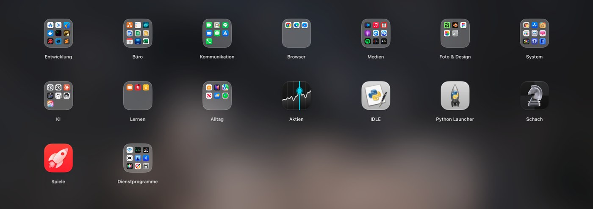
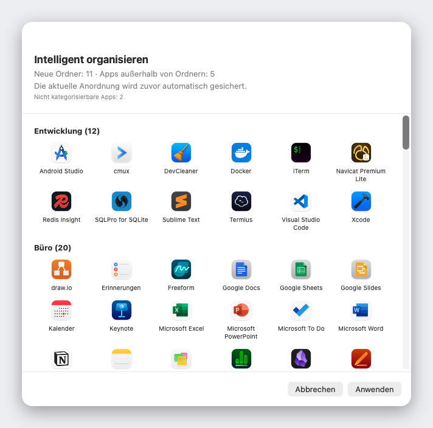

<div align="center">


# Liftoff

**Das Launchpad, das macOS 26 gestrichen hat – zurück, schneller und mit Live-Fenstervorschau.**

[](../LICENSE)


[](https://github.com/firstfu/Liftoff/releases/latest)


<a href="https://github.com/firstfu/Liftoff/releases/latest"><b>Liftoff.zip herunterladen</b></a>

[English](../README.md) · [繁體中文](README.zh-Hant.md) · [简体中文](README.zh-Hans.md) · [日本語](README.ja.md) · [한국어](README.ko.md) · **Deutsch** · [Français](README.fr.md) · [Español](README.es.md) · [Português](README.pt-BR.md) · [Italiano](README.it.md) · [Русский](README.ru.md) · [Türkçe](README.tr.md) · [Nederlands](README.nl.md)


</div>

> [!NOTE]
> Liftoff braucht **macOS 26 oder neuer**. Die App ist **noch nicht von Apple notarisiert**, deshalb blockiert macOS den ersten Start: Öffne Systemeinstellungen → Datenschutz & Sicherheit und klicke einmalig auf **Dennoch öffnen** ([Schritte](#installation)). Der gesamte Code liegt hier, und [wofür jede Berechtigung genutzt wird](#berechtigungen-im-überblick), steht weiter unten.

## Warum Liftoff

Mit macOS 26 ist das klassische Launchpad-Raster der „Apps“-Liste gewichen. Wenn du das Raster mochtest – Seiten, Ordner, Umsortieren per Drag-and-drop, Tippen zum Suchen –, bringt Liftoff es zurück. Von Grund auf für macOS 26 gebaut und an harten Performance-Grenzen gemessen: Es öffnet sich in unter 3 ms, lässt beim Blättern keinen einzigen Frame fallen und braucht im Leerlauf 0 % CPU.

Und dann kommt dazu, was das Original nie konnte.



## Funktionen

### Live-Fenstervorschau

Lass den Zeiger auf einer laufenden App ruhen (oder drücke darauf die <kbd>Leertaste</kbd>), und ihre Fenster erscheinen als Miniaturen. Ein Klick auf eine Miniatur springt direkt zu diesem Fenster – auch bei minimierten Fenstern und Fenstern auf anderen Schreibtischen.


### Eine Suche, die Apps *und* Fenster findet

Tipp ein paar Buchstaben. Liftoff findet App-Namen, Initialen (`vsc` → Visual Studio Code), Pinyin bei chinesischen Namen und die Titel deiner geöffneten Fenster.


### Intelligent organisieren

Ein Klick sortiert deine gesamte App-Sammlung in sinnvolle Ordner – Entwickler-Werkzeuge, Büro & Dokumente, Medien, Dienstprogramme … Vorher siehst du eine vollständige Vorschau, nichts ändert sich, bevor du auf „Anwenden“ klickst, und deine aktuelle Anordnung wird automatisch gesichert.

Grundlage ist eine eingebaute Tabelle mit über 1.000 beliebten Mac-Apps (darunter auch in China, Japan, Korea und Taiwan beliebte Apps) – keine Vermutungen: keine KI, kein Netzwerk, jedes Mal dasselbe Ergebnis. Fehlt eine App? Dann reicht eine Zeile in [`AppCategories.json`](../Liftoff/Resources/AppCategories.json) – Pull Requests sind willkommen.



### Und noch mehr

- **App ins Dock ziehen**, direkt aus dem Raster – das Fenster macht dabei automatisch Platz
- **Alte Launchpad-Anordnung importieren** oder mit „Intelligent organisieren“ ganz neu starten
- Öffne es, wie du willst: Tastenkurzbefehl (standardmäßig <kbd>⌃⌘L</kbd>), Zusammenziehen mit Daumen und drei Fingern, eine aktive Ecke, das Dock-Symbol oder `open liftoff://toggle`
- Seiten, Ordner (zum Zusammenführen ziehen), Umsortieren per Drag-and-drop, Tastaturnavigation
- Unscharfes Hintergrundbild (am sparsamsten), Live-Unschärfe oder ein eigenes Bild; Symbolgröße, Beschriftungsgröße und Farben einstellbar
- Mehrere Displays werden unterstützt · Apps ausblenden · Apps samt Restdateien deinstallieren · Anordnung sichern und wiederherstellen
- 13 Sprachen, passend zur Systemsprache


## Performance

Von der App selbst auf einem echten Mac gemessen (mit `scripts/selftest.sh` kannst du die Zahlen auf deinem Mac nachmessen):

| | |
|---|---|
| Fenster öffnen | **< 3 ms** |
| Suche, pro Tastenanschlag | **< 8 ms** |
| Blättern | **0 verlorene Frames** |
| Leerlauf | **0 % CPU** |

## Datenschutz

Liftoff baut **keine Netzwerkverbindungen** auf, es sei denn, du bittest es, nach Updates zu suchen. Fensterminiaturen werden lokal aufgenommen und angezeigt und verlassen deinen Mac nie.
Die einzige mögliche Verbindung ist die Update-Prüfung: eine Anfrage an die GitHub-API, um die neueste Versionsnummer zu lesen. Sie wird nur gesendet, wenn du auf **Nach Updates suchen…** klickst oder in den Einstellungen **Wöchentlich nach Updates suchen** aktivierst (standardmäßig aus). Es werden keine Daten über dich gesendet.

Du musst mir das nicht einfach glauben: Der Code, der die jeweilige Berechtigung nutzt, liegt in [`Liftoff/Preview`](../Liftoff/Preview) (Aufnahme von Bildschirm & Systemaudio: Miniaturen; Bedienungshilfen: Fenster auflisten und wechseln) und [`Liftoff/Services`](../Liftoff/Services) (Tastenkurzbefehl, aktive Ecke, Trackpad-Geste und die Update-Prüfung in `UpdateChecker.swift`). Auch Little Snitch oder LuLu bestätigen es dir.

### Hinweis zu privaten APIs

Zwei Funktionen nutzen undokumentierte macOS-APIs. Beide werden dynamisch geladen und haben einen Fallback – verschwinden die Symbole, schaltet sich die Funktion von selbst ab, statt abzustürzen:

- [`Liftoff/Preview/PrivateAPI.swift`](../Liftoff/Preview/PrivateAPI.swift) – SkyLight / HIServices zum Auflisten und Wechseln von Fenstern (derselbe Ansatz wie bei AltTab und Hammerspoon)
- [`Liftoff/Services/TrackpadGesture.swift`](../Liftoff/Services/TrackpadGesture.swift) – MultitouchSupport für die Zusammenziehen-Geste (derselbe Ansatz wie bei BetterTouchTool und MiddleClick)

## Installation

1. Lade `Liftoff.zip` von den [Releases](https://github.com/firstfu/Liftoff/releases/latest) herunter und entpacke es.
2. Verschiebe `Liftoff.app` nach `/Applications`.
3. Öffne die App. macOS blockiert sie beim ersten Mal, weil sie noch nicht von Apple notarisiert ist: Öffne **Systemeinstellungen → Datenschutz & Sicherheit**, scrolle nach unten und klicke bei *„Liftoff“ wurde blockiert, um deinen Mac zu schützen.* auf **Dennoch öffnen**.
4. Erteile die Berechtigungen, nach denen die App fragt: **Bedienungshilfen** (Fenster auflisten und wechseln) und **Aufnahme von Bildschirm & Systemaudio** (Fensterminiaturen, nur lokal).

Erfordert **macOS 26 oder neuer**, Apple Silicon oder Intel.

### Aktualisieren

Ersetze `Liftoff.app` in `/Applications` durch die neue Version. Die Builds sind ad-hoc signiert, deshalb behandelt macOS jede Version als neue App: Du klickst einmal auf **Dennoch öffnen**, und Aufnahme von Bildschirm & Systemaudio sowie Bedienungshilfen müssen erneut aktiviert werden (sieht ein Schalter aktiv aus, bewirkt aber nichts, entferne Liftoff mit **−** aus der Liste und füge es wieder hinzu).
Um von neuen Versionen zu erfahren: Wähle **Nach Updates suchen…** im Menü in der Menüleiste oder in den Einstellungen, aktiviere in den Einstellungen **Wöchentlich nach Updates suchen** (standardmäßig aus) oder nutze **Watch → Custom → Releases** auf dieser Seite.

## Berechtigungen im Überblick

| Berechtigung | Nötig? | Wofür | Wenn du sie überspringst |
|---|---|---|---|
| **Aufnahme von Bildschirm & Systemaudio** | Nur für Fenstervorschauen | Fensterminiaturen und -titel (nur auf deinem Mac aufgenommen und angezeigt) | Keine Fenstervorschauen; Liftoff bleibt ein vollwertiger Launcher |
| **Bedienungshilfen** | Optional | Minimierte Fenster auflisten und genau das angeklickte Fenster nach vorn holen | Minimierte Fenster werden nicht aufgelistet; das Wechseln ist weniger genau |

Weitere Berechtigungen werden nicht angefragt. Der Launcher selbst braucht überhaupt keine Berechtigung.

## FAQ

<details>
<summary><b>macOS meldet: „Liftoff“ wurde blockiert, um deinen Mac zu schützen</b></summary>

Liftoff ist noch nicht von Apple notarisiert. Öffne Systemeinstellungen → Datenschutz & Sicherheit, scrolle nach unten und klicke bei der Meldung auf **Dennoch öffnen**. Das ist pro Version ein einmaliger Schritt.
</details>

<details>
<summary><b>Fenstervorschauen erscheinen nicht oder zeigen keine Miniaturen</b></summary>

Prüfe, ob in Systemeinstellungen → Datenschutz & Sicherheit für Liftoff **Aufnahme von Bildschirm & Systemaudio** (für die Vorschauen nötig) und optional **Bedienungshilfen** (minimierte Fenster, genaues Wechseln) aktiviert sind. Sieht ein Schalter aktiv aus, aber nichts funktioniert – häufig nach einem Update –, entferne Liftoff mit **−** aus der Liste und füge es wieder hinzu.
</details>

<details>
<summary><b>Verliere ich Berechtigungen, wenn ich aktualisiere?</b></summary>

Ja, bei den ad-hoc signierten Releases: macOS sieht jede Version als neue App, deshalb müssen Aufnahme von Bildschirm & Systemaudio und Bedienungshilfen erneut erlaubt werden. Wenn du die App selbst mit deinem eigenen Zertifikat baust, bleibt das erspart – siehe [`Config/Signing.xcconfig`](../Config/Signing.xcconfig).
</details>

<details>
<summary><b>Tastenkurzbefehl, Zusammenziehen oder aktive Ecke öffnen es nicht</b></summary>

Möglicherweise belegt schon eine andere App den Tastenkurzbefehl (Einstellungen → Auslöser zeigt eine Warnung); wähle einen anderen. Die Zusammenziehen-Geste schaltet die eigene macOS-Geste für „Apps“ vorübergehend ab, solange Liftoff läuft, und stellt sie wieder her, wenn du sie ausschaltest oder die App beendest. `open liftoff://toggle` funktioniert immer.
</details>

<details>
<summary><b>Wie deinstalliere ich es?</b></summary>

Beende Liftoff in der Menüleiste, lösche `Liftoff.app` aus `/Applications` und entferne es unter Systemeinstellungen → Allgemein → Anmeldeobjekte & Erweiterungen, falls du *Bei der Anmeldung öffnen* aktiviert hattest. Um auch die Einstellungen zu entfernen: `defaults delete com.firstfu.Liftoff` und lösche `~/Library/Caches/com.firstfu.Liftoff`.
</details>

## Worin es sich von ähnlichen Tools unterscheidet

[LaunchNext](https://github.com/RoversX/LaunchNext) ist ein gutes, aktives Open-Source-Projekt: Es ist notarisiert, importiert die alte Launchpad-Anordnung und bietet unscharfe Suche und Ordner. Wenn du das brauchst, nimm es. Was Liftoff obendrauf bietet: Live-Miniaturen der Fenster einer laufenden App (Klick zum Hinspringen, auch minimierte), eine Suche, die auch Fenstertitel findet, „Intelligent organisieren“ mit einem Klick (eingebaute Tabelle, keine KI, vorher Vorschau), Apps aus dem Raster ins Dock ziehen und Performance-Zahlen, die du selbst nachmessen kannst. Der Kompromiss heute: LaunchNext ist notarisiert, Liftoff noch nicht.

## Sprachen

Liftoff folgt deiner Systemsprache: English, 繁體中文, 简体中文, 日本語, 한국어, Deutsch, Français, Español, Português (Brasil), Italiano, Русский, Türkçe und Nederlands. Alles andere fällt auf Englisch zurück.

Dir ist eine holprige Übersetzung aufgefallen, oder du möchtest eine Sprache hinzufügen? Der gesamte Oberflächentext steckt in einer einzigen Datei, [`Liftoff/Resources/Localizable.xcstrings`](../Liftoff/Resources/Localizable.xcstrings) – öffne sie in Xcode oder schick einen Pull Request.

## Aus dem Quellcode bauen

Erfordert Xcode 26 und [XcodeGen](https://github.com/yonaskolb/XcodeGen) (`brew install xcodegen`).

```sh
git clone https://github.com/firstfu/Liftoff.git && cd Liftoff
xcodegen generate
xcodebuild -project Liftoff.xcodeproj -scheme Liftoff -configuration Release -derivedDataPath build build
open build/Build/Products/Release/Liftoff.app
```

Du brauchst keinen Apple-Account – Builds sind standardmäßig ad-hoc signiert. Wenn du mit deinem eigenen Zertifikat signieren willst (damit macOS die Berechtigungen für Bedienungshilfen und Aufnahme von Bildschirm & Systemaudio über Neubuilds hinweg behält), schau in [`Config/Signing.xcconfig`](../Config/Signing.xcconfig).
Tests: Ersetze im `xcodebuild`-Befehl `build` durch `test`. `scripts/install.sh` baut Release, installiert nach `/Applications` und richtet den Start bei der Anmeldung ein.

## Mitmachen

Kostenlos und Open Source, von einer einzelnen Person gebaut – [Issues](https://github.com/firstfu/Liftoff/issues/new/choose) und Pull Requests sind herzlich willkommen. Am einfachsten hilfst du so: eine Übersetzung korrigieren, eine fehlende App in [`AppCategories.json`](../Liftoff/Resources/AppCategories.json) ergänzen oder einen Bug samt deiner macOS-Version melden.

## Lizenz

[GPLv3](../LICENSE). Du darfst es frei nutzen, untersuchen, verändern und weitergeben; veränderte Versionen, die du verbreitest, müssen unter derselben Lizenz Open Source bleiben.
