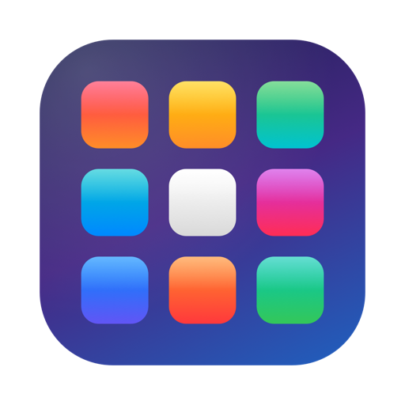
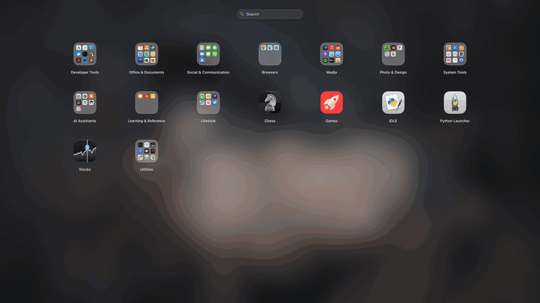
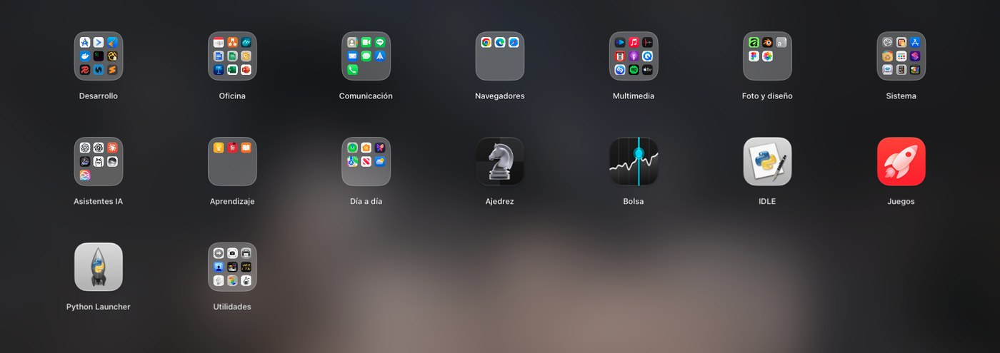
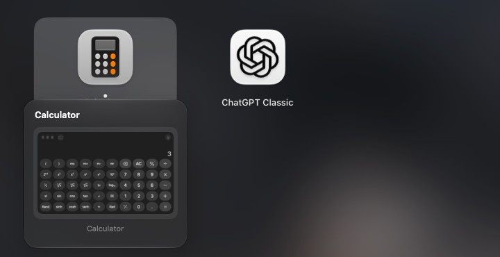
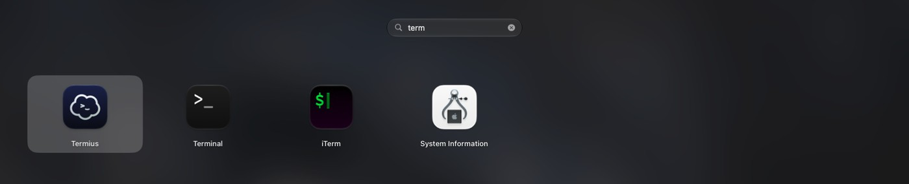
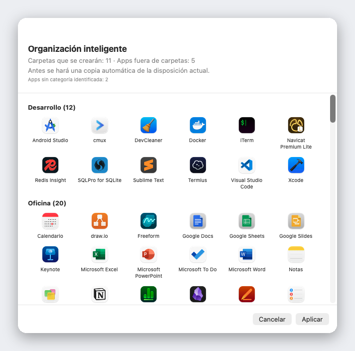
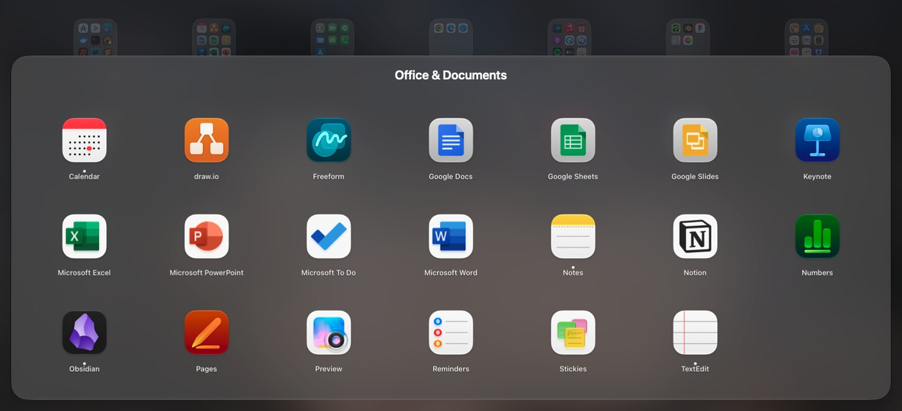

<div align="center">



# Liftoff

**El Launchpad que macOS 26 te quitó: de vuelta, más rápido y con previsualización de ventanas en vivo.**

[](../LICENSE)


[](https://github.com/firstfu/Liftoff/releases/latest)


<a href="https://github.com/firstfu/Liftoff/releases/latest"><b>Descargar Liftoff.zip</b></a>

[English](../README.md) · [繁體中文](README.zh-Hant.md) · [简体中文](README.zh-Hans.md) · [日本語](README.ja.md) · [한국어](README.ko.md) · [Deutsch](README.de.md) · [Français](README.fr.md) · **Español** · [Português](README.pt-BR.md) · [Italiano](README.it.md) · [Русский](README.ru.md) · [Türkçe](README.tr.md) · [Nederlands](README.nl.md)



</div>

> [!NOTE]
> Liftoff requiere **macOS 26 o posterior**. **Todavía no está notarizado por Apple**, así que macOS bloquea el primer arranque: abre Ajustes del Sistema → Privacidad y seguridad y haz clic una vez en **Abrir igualmente** ([pasos](#instalación)). Todo el código está aquí, y [para qué sirve cada permiso](#permisos-de-un-vistazo) se explica más abajo.

## Por qué Liftoff

macOS 26 sustituyó la clásica cuadrícula del Launchpad por la lista «Apps». Si te gustaba la cuadrícula (páginas, carpetas, arrastrar para reordenar, escribir para buscar), Liftoff te la devuelve. Está construido desde cero para macOS 26 y con límites de rendimiento estrictos: se abre en menos de 3 ms, no pierde ni un fotograma al cambiar de página y consume un 0 % de CPU en reposo.

Y además añade lo que el original nunca tuvo.



## Características

### Previsualización de ventanas en vivo

Deja el puntero sobre una app en ejecución (o pulsa <kbd>Espacio</kbd> sobre ella) y sus ventanas aparecerán como miniaturas. Haz clic en una para ir directamente a esa ventana, incluso si está minimizada o en otro escritorio.



### Una búsqueda que encuentra apps *y* ventanas

Escribe unas pocas letras. Liftoff busca por nombre de app, por iniciales (`vsc` → Visual Studio Code), por pinyin en los nombres chinos y por los títulos de tus ventanas abiertas.



### Organización inteligente

Con un clic, toda tu colección de apps se ordena en carpetas con sentido: herramientas de desarrollo, documentos y oficina, multimedia, utilidades… Primero ves una previsualización completa, no cambia nada hasta que pulsas Aplicar y tu disposición actual se guarda automáticamente en una copia de seguridad.

Funciona con una tabla integrada de más de 1.000 apps populares para Mac (incluidas las más usadas en China, Japón, Corea y Taiwán), sin adivinar: sin IA, sin red y con el mismo resultado siempre. ¿Falta alguna app? Basta una línea en [`AppCategories.json`](../Liftoff/Resources/AppCategories.json); los pull requests son bienvenidos.



### Y más

- **Arrastra una app al Dock** directamente desde la cuadrícula: el panel se aparta solo
- **Importa tu antigua disposición del Launchpad**, o empieza de cero con la Organización inteligente
- Ábrelo como prefieras: atajo de teclado (<kbd>⌃⌘L</kbd> por defecto), gesto de pellizco con el pulgar y tres dedos, una esquina activa, el icono del Dock o `open liftoff://toggle`
- Páginas, carpetas (arrastra para combinar), arrastrar para reordenar y navegación con el teclado
- Fondo de pantalla desenfocado (el de menor consumo), desenfoque en vivo o tu propia imagen; tamaño de iconos, tamaño de etiquetas y colores ajustables
- Compatible con varias pantallas · oculta apps · desinstala apps y sus archivos residuales · copia de seguridad y restauración de tu disposición
- 13 idiomas, según el idioma del sistema



## Rendimiento

Medido por la propia app en un Mac real (`scripts/selftest.sh` reproduce las cifras en el tuyo):

| | |
|---|---|
| Abrir el panel | **< 3 ms** |
| Búsqueda, por pulsación de tecla | **< 8 ms** |
| Cambio de página | **0 fotogramas perdidos** |
| En reposo | **0 % de CPU** |

## Privacidad

Liftoff **no establece ninguna conexión de red**, salvo que le pidas buscar actualizaciones. Las miniaturas de las ventanas se capturan y se muestran en local y nunca salen de tu Mac.
La única conexión que puede hacer es la búsqueda de actualizaciones: una petición a la API de GitHub para leer el número de la última versión, que solo se envía cuando haces clic en **Buscar actualizaciones…** o activas **Buscar actualizaciones cada semana** en los ajustes (desactivado por defecto). No se envía ningún dato sobre ti.

No hace falta que me creas: el código que usa cada permiso está en [`Liftoff/Preview`](../Liftoff/Preview) (Grabación de pantalla: miniaturas; Accesibilidad: listar y cambiar de ventana) y en [`Liftoff/Services`](../Liftoff/Services) (atajo de teclado, esquina activa, gesto del trackpad y la búsqueda de actualizaciones en `UpdateChecker.swift`). Little Snitch o LuLu también te lo confirmarán.

### Nota sobre las API privadas

Dos funciones usan API no documentadas de macOS. Ambas se cargan de forma dinámica y con una alternativa: si los símbolos desaparecen, la función se desactiva sola en lugar de provocar un cierre inesperado.

- [`Liftoff/Preview/PrivateAPI.swift`](../Liftoff/Preview/PrivateAPI.swift): SkyLight / HIServices, para enumerar y cambiar de ventana (el mismo enfoque que AltTab y Hammerspoon)
- [`Liftoff/Services/TrackpadGesture.swift`](../Liftoff/Services/TrackpadGesture.swift): MultitouchSupport, para el gesto de pellizco (el mismo enfoque que BetterTouchTool y MiddleClick)

## Instalación

1. Descarga `Liftoff.zip` desde [Releases](https://github.com/firstfu/Liftoff/releases/latest) y descomprímelo.
2. Mueve `Liftoff.app` a `/Applications`.
3. Ábrelo. macOS lo bloqueará la primera vez porque Apple aún no lo ha notarizado: abre **Ajustes del Sistema → Privacidad y seguridad**, desplázate hacia abajo y haz clic en **Abrir igualmente** junto a *Se ha bloqueado Liftoff para proteger tu Mac.*
4. Concede los permisos que te pida: **Accesibilidad** (listar y cambiar de ventana) y **Grabación de pantalla y del audio del sistema** (miniaturas de ventanas, solo en local).

Requiere **macOS 26 o posterior**, Apple silicon o Intel.

### Actualizar

Sustituye `Liftoff.app` en `/Applications` por la nueva versión. Las compilaciones tienen firma ad hoc, así que macOS trata cada versión como una app nueva: haces clic una vez en **Abrir igualmente**, y hay que volver a activar Grabación de pantalla y del audio del sistema y Accesibilidad (si un interruptor parece activado pero no hace nada, quita Liftoff de la lista con **−** y vuelve a añadirlo).
Para enterarte de las nuevas versiones: elige **Buscar actualizaciones…** en el menú de la barra de menús o en los ajustes, activa **Buscar actualizaciones cada semana** en los ajustes (desactivado por defecto), o usa **Watch → Custom → Releases** en esta página.

## Permisos de un vistazo

| Permiso | ¿Necesario? | Para qué | Si lo omites |
|---|---|---|---|
| **Grabación de pantalla y del audio del sistema** | Solo para las vistas previas de ventanas | Miniaturas y títulos de ventanas (se capturan y se muestran solo en tu Mac) | Sin vistas previas de ventanas; Liftoff sigue siendo un lanzador |
| **Accesibilidad** | Opcional | Listar ventanas minimizadas e ir exactamente a la ventana en la que hiciste clic | Las ventanas minimizadas no se listan; el cambio de ventana es menos preciso |

No se pide nada más. El lanzador en sí no necesita ningún permiso.

## Preguntas frecuentes

<details>
<summary><b>macOS dice «Se ha bloqueado Liftoff para proteger tu Mac»</b></summary>

Apple aún no ha notarizado Liftoff. Abre Ajustes del Sistema → Privacidad y seguridad, desplázate hacia abajo y haz clic en **Abrir igualmente** junto al mensaje. Es un paso que se hace una sola vez por versión.
</details>

<details>
<summary><b>Las vistas previas de ventanas no aparecen o no muestran miniaturas</b></summary>

Comprueba que **Grabación de pantalla y del audio del sistema** (necesaria para las vistas previas) y, opcionalmente, **Accesibilidad** (ventanas minimizadas, cambio de ventana preciso) estén activadas para Liftoff en Ajustes del Sistema → Privacidad y seguridad. Si un interruptor parece activado pero nada funciona (es habitual tras una actualización), quita Liftoff de la lista con **−** y vuelve a añadirlo.
</details>

<details>
<summary><b>¿Pierdo los permisos al actualizar?</b></summary>

Sí, con las versiones de firma ad hoc: macOS ve cada versión como una app nueva, así que hay que volver a permitir Grabación de pantalla y del audio del sistema y Accesibilidad. Compilarlo tú mismo con tu propio certificado lo evita; consulta [`Config/Signing.xcconfig`](../Config/Signing.xcconfig).
</details>

<details>
<summary><b>El atajo de teclado, el gesto de pellizco o la esquina activa no lo abren</b></summary>

Puede que otra app ya use ese atajo (Ajustes → Activación muestra un aviso); elige otro. El gesto de pellizco desactiva temporalmente el gesto de pellizco propio de macOS para «Apps» mientras Liftoff está en ejecución y lo restaura cuando lo desactivas o cierras la app. `open liftoff://toggle` siempre funciona.
</details>

<details>
<summary><b>¿Cómo lo desinstalo?</b></summary>

Cierra Liftoff desde la barra de menús, elimina `Liftoff.app` de `/Applications` y quítalo de Ajustes del Sistema → General → Ítems de inicio y extensiones si habías activado *Abrir al iniciar sesión*. Para borrar también sus ajustes: `defaults delete com.firstfu.Liftoff` y elimina `~/Library/Caches/com.firstfu.Liftoff`.
</details>

## En qué se diferencia de herramientas similares

[LaunchNext](https://github.com/RoversX/LaunchNext) es un buen proyecto de código abierto, activo: está notarizado, importa la antigua disposición del Launchpad y tiene búsqueda aproximada y carpetas. Si es lo que necesitas, úsalo. Lo que Liftoff añade: miniaturas en vivo de las ventanas de una app en ejecución (clic para ir a ellas, incluidas las minimizadas), una búsqueda que también encuentra títulos de ventanas, Organización inteligente en un clic (tabla de consulta integrada, sin IA, con vista previa antes), arrastrar apps de la cuadrícula al Dock y cifras de rendimiento que puedes reproducir. La contrapartida actual: LaunchNext está notarizado y Liftoff todavía no.

## Idiomas

Liftoff sigue el idioma de tu sistema: English, 繁體中文, 简体中文, 日本語, 한국어, Deutsch, Français, Español, Português (Brasil), Italiano, Русский, Türkçe y Nederlands. Cualquier otro idioma usa inglés.

¿Has visto una traducción poco natural o quieres añadir un idioma? Todo el texto de la interfaz está en un único archivo, [`Liftoff/Resources/Localizable.xcstrings`](../Liftoff/Resources/Localizable.xcstrings): ábrelo en Xcode o envía un pull request.

## Compilar desde el código fuente

Requiere Xcode 26 y [XcodeGen](https://github.com/yonaskolb/XcodeGen) (`brew install xcodegen`).

```sh
git clone https://github.com/firstfu/Liftoff.git && cd Liftoff
xcodegen generate
xcodebuild -project Liftoff.xcodeproj -scheme Liftoff -configuration Release -derivedDataPath build build
open build/Build/Products/Release/Liftoff.app
```

No necesitas cuenta de Apple: las compilaciones usan firma ad hoc por defecto. Para firmar con tu propio certificado (y que macOS conserve los permisos de Accesibilidad y Grabación de pantalla y del audio del sistema entre compilaciones), consulta [`Config/Signing.xcconfig`](../Config/Signing.xcconfig).
Pruebas: sustituye `build` por `test` en el comando `xcodebuild`. `scripts/install.sh` compila en Release, instala en `/Applications` y registra el inicio al arrancar la sesión.

## Contribuir

Libre, de código abierto y hecho por una sola persona: los [issues](https://github.com/firstfu/Liftoff/issues/new/choose) y los pull requests son muy bienvenidos. Las formas más fáciles de ayudar: corregir una traducción, añadir una app que falte a [`AppCategories.json`](../Liftoff/Resources/AppCategories.json) o informar de un error indicando tu versión de macOS.

## Licencia

[GPLv3](../LICENSE). Eres libre de usarlo, estudiarlo, modificarlo y compartirlo; las versiones modificadas que distribuyas deben seguir siendo de código abierto bajo la misma licencia.
