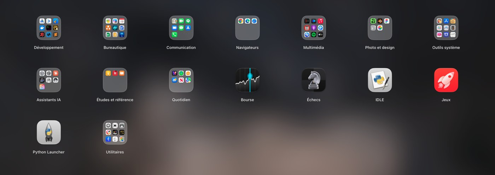
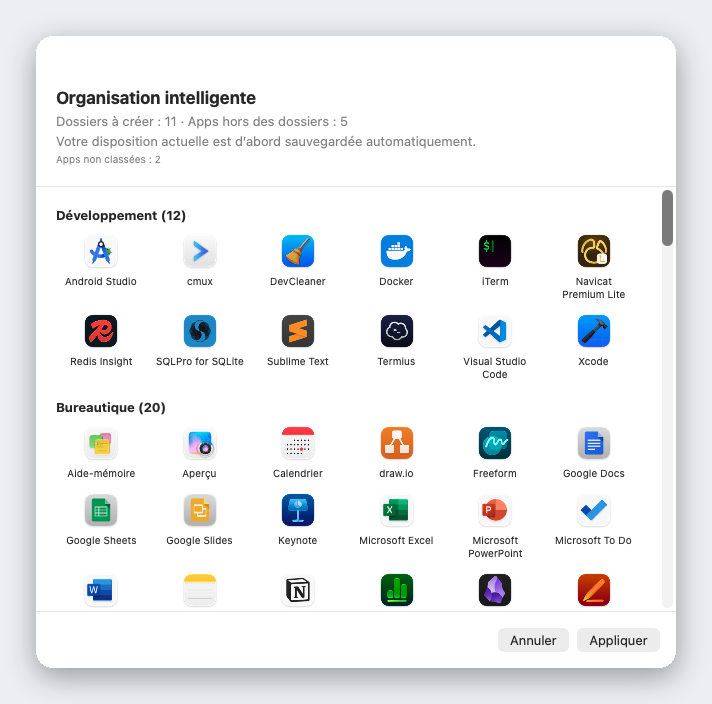

<div align="center">


# Liftoff

**Le Launchpad que macOS 26 vous a retiré — de retour, plus rapide, avec des aperçus de fenêtres en direct.**

[](../LICENSE)


[](https://github.com/firstfu/Liftoff/releases/latest)


[Télécharger](https://github.com/firstfu/Liftoff/releases/latest)

[English](../README.md) · [繁體中文](README.zh-Hant.md) · [简体中文](README.zh-Hans.md) · [日本語](README.ja.md) · [한국어](README.ko.md) · [Deutsch](README.de.md) · **Français** · [Español](README.es.md) · [Português](README.pt-BR.md) · [Italiano](README.it.md) · [Русский](README.ru.md) · [Türkçe](README.tr.md) · [Nederlands](README.nl.md)


</div>

## Pourquoi Liftoff

macOS 26 a remplacé la grille du Launchpad par une simple liste « Apps ». Si vous aimiez la grille — pages, dossiers, glisser pour réorganiser, taper pour chercher — Liftoff vous la rend. Il a été conçu de zéro pour macOS 26, avec des exigences de performance strictes : il s’ouvre en moins de 3 ms, ne perd pas une image pendant le changement de page et consomme 0 % de CPU au repos.

Et il ajoute ce que l’original n’a jamais eu.



## Fonctionnalités

### Aperçu des fenêtres en direct

Laissez le pointeur sur une app ouverte (ou appuyez sur <kbd>Espace</kbd>) et ses fenêtres apparaissent sous forme de miniatures. Cliquez sur l’une d’elles pour passer directement à cette fenêtre, y compris si elle est réduite ou située sur un autre bureau.


### Une recherche qui trouve les apps *et* les fenêtres

Tapez quelques lettres. Liftoff reconnaît les noms d’apps, les initiales (`vsc` → Visual Studio Code), le pinyin pour les noms chinois, ainsi que les titres de vos fenêtres ouvertes.


### Organisation intelligente

Un clic range toute votre collection d’apps dans des dossiers cohérents : Outils de développement, Bureautique et documents, Médias, Utilitaires… Vous voyez d’abord un aperçu complet, rien ne change tant que vous n’appuyez pas sur Appliquer, et votre disposition actuelle est sauvegardée automatiquement.

Le classement repose sur une table intégrée de plus de 1 000 apps Mac populaires (dont des apps courantes en Chine, au Japon, en Corée et à Taïwan), pas sur des suppositions : pas d’IA, pas de réseau, et le même résultat à chaque fois. Il manque une app ? Il suffit d’une ligne dans [`AppCategories.json`](../Liftoff/Resources/AppCategories.json) — les pull requests sont les bienvenues.



### Et ce n’est pas tout

- **Glissez une app vers le Dock** directement depuis la grille — le panneau s’efface tout seul
- **Importez l’ancienne disposition de votre Launchpad**, ou repartez de zéro avec l’Organisation intelligente
- Ouvrez-le comme vous voulez : raccourci clavier (<kbd>⌃⌘L</kbd> par défaut), pincement pouce + trois doigts, un coin actif, l’icône du Dock ou `open liftoff://toggle`
- Pages, dossiers (glissez pour fusionner), réorganisation par glisser-déposer, navigation au clavier
- Fond d’écran flou (le plus économe en énergie), flou en direct ou votre propre image ; taille des icônes, taille des légendes et couleurs réglables
- Gestion de plusieurs moniteurs · masquage d’apps · désinstallation d’apps avec leurs fichiers résiduels · sauvegarde et restauration de votre disposition
- 13 langues, selon la langue du système


## Performances

Mesuré sur un vrai Mac par l’app elle-même (`scripts/selftest.sh` reproduit ces chiffres sur le vôtre) :

| | |
|---|---|
| Ouverture du panneau | **< 3 ms** |
| Recherche, par frappe | **< 8 ms** |
| Changement de page | **0 image perdue** |
| Au repos | **0 % de CPU** |

## Confidentialité

Liftoff **n’établit aucune connexion réseau**. Les miniatures des fenêtres sont capturées et affichées en local, et ne quittent jamais votre Mac.
Ne me croyez pas sur parole : le code qui utilise chaque autorisation se trouve dans [`Liftoff/Preview`](../Liftoff/Preview) (Enregistrement de l’écran : miniatures ; Accessibilité : liste des fenêtres et changement de fenêtre) et [`Liftoff/Services`](../Liftoff/Services) (raccourci clavier, coin actif, geste au trackpad). Little Snitch ou LuLu le confirmeront aussi.

### À propos des API privées

Deux fonctionnalités utilisent des API macOS non documentées, toutes deux chargées dynamiquement avec une solution de repli : si les symboles disparaissent, la fonctionnalité se désactive d’elle-même au lieu de planter.

- [`Liftoff/Preview/PrivateAPI.swift`](../Liftoff/Preview/PrivateAPI.swift) — SkyLight / HIServices, pour lister les fenêtres et passer de l’une à l’autre (même approche qu’AltTab et Hammerspoon)
- [`Liftoff/Services/TrackpadGesture.swift`](../Liftoff/Services/TrackpadGesture.swift) — MultitouchSupport, pour le geste de pincement (même approche que BetterTouchTool et MiddleClick)

## Installation

Nécessite **macOS 26 ou version ultérieure**.

1. Téléchargez `Liftoff.zip` depuis les [Releases](https://github.com/firstfu/Liftoff/releases/latest) et décompressez-le.
2. Déplacez `Liftoff.app` dans `/Applications`.
3. Ouvrez-le. macOS le bloquera la première fois, car il n’est pas encore notarisé par Apple : ouvrez **Réglages Système → Confidentialité et sécurité**, faites défiler vers le bas et cliquez sur **Ouvrir quand même** à côté de *« Liftoff » a été bloqué pour protéger votre Mac.*
4. Accordez les autorisations demandées : **Accessibilité** (lister les fenêtres et passer de l’une à l’autre) et **Enregistrement de l’écran et des sons du système** (miniatures des fenêtres, en local uniquement).

> Les versions sont signées ad hoc : macOS vous demandera donc de réactiver Accessibilité et Enregistrement de l’écran et des sons du système après chaque mise à jour.

## Langues

Liftoff suit la langue de votre système : English, 繁體中文, 简体中文, 日本語, 한국어, Deutsch, Français, Español, Português (Brasil), Italiano, Русский, Türkçe et Nederlands. Toute autre langue retombe sur l’anglais.

Une traduction maladroite, ou l’envie d’ajouter une langue ? Tous les textes de l’interface se trouvent dans un seul fichier, [`Liftoff/Resources/Localizable.xcstrings`](../Liftoff/Resources/Localizable.xcstrings) — ouvrez-le dans Xcode, ou envoyez une pull request.

## Compiler depuis les sources

Nécessite Xcode 26 et [XcodeGen](https://github.com/yonaskolb/XcodeGen) (`brew install xcodegen`).

```sh
git clone https://github.com/firstfu/Liftoff.git && cd Liftoff
xcodegen generate
xcodebuild -project Liftoff.xcodeproj -scheme Liftoff -configuration Release -derivedDataPath build build
open build/Build/Products/Release/Liftoff.app
```

Aucun compte Apple nécessaire : les builds sont signés ad hoc par défaut. Pour signer avec votre propre certificat (afin que macOS conserve les autorisations Accessibilité et Enregistrement de l’écran et des sons du système d’une compilation à l’autre), voir [`Config/Signing.xcconfig`](../Config/Signing.xcconfig).
Tests : remplacez `build` par `test` dans la commande `xcodebuild`. `scripts/install.sh` compile en Release, installe dans `/Applications` et enregistre l’ouverture à la session.

## Contribuer

Libre et open source, développé par une seule personne — les [issues](https://github.com/firstfu/Liftoff/issues/new/choose) et les pull requests sont les bienvenues. Les moyens les plus simples d’aider : corriger une traduction, ajouter une app manquante à [`AppCategories.json`](../Liftoff/Resources/AppCategories.json), ou signaler un bug en précisant votre version de macOS.

## Licence

[GPLv3](../LICENSE). Vous êtes libre de l’utiliser, de l’étudier, de le modifier et de le partager ; les versions modifiées que vous distribuez doivent rester open source sous la même licence.
