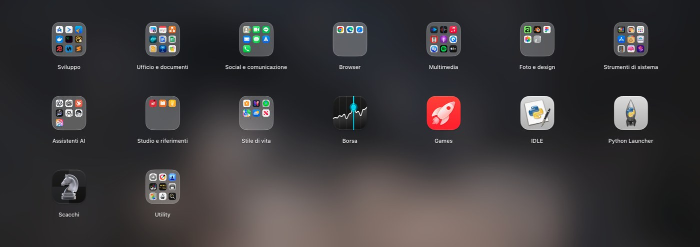
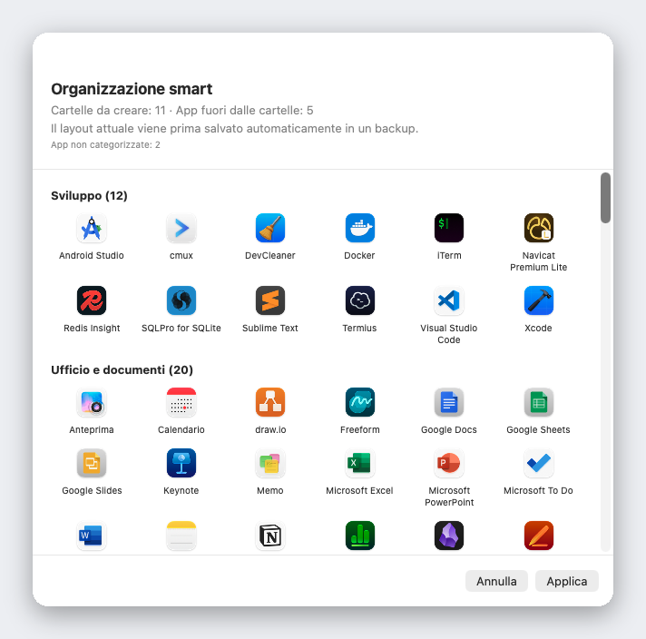

<div align="center">


# Liftoff

**Il Launchpad che macOS 26 ti ha tolto: di nuovo qui, più veloce e con le anteprime delle finestre in tempo reale.**

[](../LICENSE)


[](https://github.com/firstfu/Liftoff/releases/latest)

[](https://alternativeto.net/software/liftoff-by-firstfu/)

<a href="https://github.com/firstfu/Liftoff/releases/latest"><b>Scarica Liftoff.zip</b></a>
&nbsp;·&nbsp;
<code>brew install --cask firstfu/tap/liftoff</code>

[English](../README.md) · [繁體中文](README.zh-Hant.md) · [简体中文](README.zh-Hans.md) · [日本語](README.ja.md) · [한국어](README.ko.md) · [Deutsch](README.de.md) · [Français](README.fr.md) · [Español](README.es.md) · [Português](README.pt-BR.md) · **Italiano** · [Русский](README.ru.md) · [Türkçe](README.tr.md) · [Nederlands](README.nl.md)


</div>

> [!NOTE]
> Liftoff richiede **macOS 26 o versioni successive**. **Non è ancora notarizzato da Apple**, quindi macOS blocca il primo avvio: apri Impostazioni di Sistema → Privacy e sicurezza e fai clic una volta su **Apri comunque** ([passaggi](#installazione)). Tutto il codice è qui, e [a cosa serve ogni permesso](#permessi-in-sintesi) è spiegato più sotto.

## Perché Liftoff

macOS 26 ha sostituito la classica griglia di Launchpad con l'elenco "App". Se la griglia ti piaceva, con le sue pagine, le cartelle, il trascinamento per riordinare e la ricerca mentre scrivi, Liftoff te la restituisce: è stato scritto da zero per macOS 26 e rispetta limiti di prestazioni rigidi. Si apre in meno di 3 ms, non perde nemmeno un fotogramma quando sfogli le pagine e a riposo usa lo 0% di CPU.

E poi aggiunge quello che l'originale non ha mai avuto.



## Funzionalità

### Anteprime delle finestre in tempo reale

Fermati con il puntatore su un'app in esecuzione (oppure premi <kbd>Spazio</kbd> su di essa) e le sue finestre compaiono come miniature. Fai clic su una per passare subito a quella finestra, comprese quelle minimizzate e quelle su altre scrivanie.


### Una ricerca che trova app *e* finestre

Scrivi poche lettere. Liftoff cerca tra i nomi delle app, le iniziali (`vsc` → Visual Studio Code), il pinyin per i nomi cinesi e i titoli delle finestre che hai aperto.


### Organizzazione smart

Con un clic tutte le tue app finiscono in cartelle sensate: strumenti di sviluppo, documenti e ufficio, contenuti multimediali, utility… Prima vedi un'anteprima completa, non cambia nulla finché non premi Applica e il layout attuale viene salvato automaticamente in un backup.

Funziona a partire da una tabella integrata con oltre 1.000 app Mac molto diffuse (comprese quelle popolari in Cina, Giappone, Corea e Taiwan), senza andare a intuito: niente AI, niente rete, sempre lo stesso risultato. Manca un'app? Basta una riga in [`AppCategories.json`](../Liftoff/Resources/AppCategories.json), e le pull request sono ben accette.



### E molto altro

- **Trascina un'app nel Dock** direttamente dalla griglia: il pannello si toglie di mezzo da solo
- **Importa il layout del vecchio Launchpad**, oppure riparti da zero con l'Organizzazione smart
- Aprilo come preferisci: scorciatoia da tastiera (<kbd>⌃⌘L</kbd> per impostazione predefinita), pizzico con pollice e tre dita, un angolo attivo, l'icona nel Dock oppure `open liftoff://toggle`
- Pagine, cartelle (trascina per unire), trascinamento per riordinare, navigazione da tastiera
- Sfondo sfocato (consumo minimo), sfocatura in tempo reale o un'immagine tua; dimensione di icone ed etichette e colori regolabili
- Supporto multi-schermo · nascondi app · disinstalla app insieme ai file residui · backup e ripristino del layout
- 13 lingue, in base alla lingua del sistema


## Prestazioni

Misurate su un Mac reale dall'app stessa (`scripts/selftest.sh` riproduce i numeri sul tuo):

| | |
|---|---|
| Apertura del pannello | **< 3 ms** |
| Ricerca, per ogni tasto | **< 8 ms** |
| Cambio pagina | **0 fotogrammi persi** |
| A riposo | **0% CPU** |

## Privacy

Liftoff **non effettua alcuna connessione di rete**, a meno che tu non gli chieda di verificare gli aggiornamenti. Le miniature delle finestre vengono catturate e mostrate in locale e non lasciano mai il tuo Mac.
L’unica connessione possibile è la verifica degli aggiornamenti: una richiesta all’API di GitHub per leggere il numero dell’ultima versione, inviata solo quando fai clic su **Verifica aggiornamenti…** o attivi **Verifica aggiornamenti ogni settimana** nelle impostazioni (disattivato per impostazione predefinita). Non viene inviato alcun dato su di te.

Non fidarti sulla parola: il codice che usa ciascun permesso si trova in [`Liftoff/Preview`](../Liftoff/Preview) (Registrazione schermo e audio di sistema: miniature; Accessibilità: elenco e cambio delle finestre) e in [`Liftoff/Services`](../Liftoff/Services) (scorciatoia da tastiera, angolo attivo, gesto sul trackpad e la verifica degli aggiornamenti in `UpdateChecker.swift`). Anche Little Snitch o LuLu te lo confermeranno.

### Una nota sulle API private

Due funzionalità usano API non documentate di macOS, entrambe caricate dinamicamente e con un fallback: se i simboli scompaiono, la funzione si disattiva da sola invece di andare in crash.

- [`Liftoff/Preview/PrivateAPI.swift`](../Liftoff/Preview/PrivateAPI.swift): SkyLight / HIServices, per elencare le finestre e passare dall'una all'altra (lo stesso approccio di AltTab e Hammerspoon)
- [`Liftoff/Services/TrackpadGesture.swift`](../Liftoff/Services/TrackpadGesture.swift): MultitouchSupport, per il gesto di pizzico (lo stesso approccio di BetterTouchTool e MiddleClick)

## Installazione

**Homebrew**: `brew install --cask firstfu/tap/liftoff` (`brew upgrade --cask liftoff`)

1. Scarica `Liftoff.zip` da [Releases](https://github.com/firstfu/Liftoff/releases/latest) e decomprimilo.
2. Sposta `Liftoff.app` in `/Applications`.
3. Aprilo. La prima volta macOS lo bloccherà, perché non è ancora notarizzato da Apple: apri **Impostazioni di Sistema → Privacy e sicurezza**, scorri verso il basso e fai clic su **Apri comunque** accanto a *Il Mac ha bloccato Liftoff per garantire la sicurezza.*
4. Concedi i permessi richiesti: **Accessibilità** (elencare e cambiare finestra) e **Registrazione schermo e audio di sistema** (miniature delle finestre, solo in locale).

Richiede **macOS 26 o versioni successive**, Apple silicon o Intel.

### Aggiornamento

Sostituisci `Liftoff.app` in `/Applications` con la nuova versione. Le build sono firmate ad-hoc, quindi macOS considera ogni versione una nuova app: fai clic una volta su **Apri comunque**, e Registrazione schermo e audio di sistema e Accessibilità vanno riattivati (se un interruttore sembra attivo ma non fa nulla, rimuovi Liftoff dall’elenco con **−** e aggiungilo di nuovo).
Per sapere delle nuove versioni: scegli **Verifica aggiornamenti…** nel menu della barra dei menu o nelle impostazioni, attiva **Verifica aggiornamenti ogni settimana** nelle impostazioni (disattivato per impostazione predefinita), oppure usa **Watch → Custom → Releases** in questa pagina.

## Permessi in sintesi

| Permesso | Necessario? | Perché | Se lo salti |
|---|---|---|---|
| **Registrazione schermo e audio di sistema** | Solo per le anteprime delle finestre | Miniature e titoli delle finestre (catturati e mostrati solo sul tuo Mac) | Niente anteprime delle finestre; Liftoff resta comunque un launcher |
| **Accessibilità** | Facoltativo | Elencare le finestre minimizzate e passare esattamente alla finestra su cui hai fatto clic | Le finestre minimizzate non vengono elencate; il cambio di finestra è meno preciso |

Non viene richiesto nient’altro. Il launcher in sé non richiede alcun permesso.

## FAQ

<details>
<summary><b>macOS dice «Il Mac ha bloccato Liftoff per garantire la sicurezza»</b></summary>

Liftoff non è ancora notarizzato da Apple. Apri Impostazioni di Sistema → Privacy e sicurezza, scorri verso il basso e fai clic su **Apri comunque** accanto al messaggio. È un passaggio da fare una sola volta per versione.
</details>

<details>
<summary><b>Le anteprime delle finestre non compaiono o non mostrano miniature</b></summary>

Controlla che **Registrazione schermo e audio di sistema** (necessaria per le anteprime) e, facoltativamente, **Accessibilità** (finestre minimizzate, cambio di finestra preciso) siano attivate per Liftoff in Impostazioni di Sistema → Privacy e sicurezza. Se un interruttore sembra attivo ma non funziona nulla (succede spesso dopo un aggiornamento), rimuovi Liftoff dall’elenco con **−** e aggiungilo di nuovo. Se Liftoff non compare affatto nell’elenco (macOS non sempre lo aggiunge da solo), fai clic su **+** sotto l’elenco e scegli Liftoff in Applicazioni.
</details>

<details>
<summary><b>Perdo i permessi quando aggiorno?</b></summary>

Sì, con le release firmate ad-hoc: macOS vede ogni versione come una nuova app, quindi Registrazione schermo e audio di sistema e Accessibilità vanno concesse di nuovo. Compilandolo tu stesso con il tuo certificato lo eviti: vedi [`Config/Signing.xcconfig`](../Config/Signing.xcconfig).
</details>

<details>
<summary><b>La scorciatoia, il gesto di pizzico o l’angolo attivo non lo aprono</b></summary>

Un’altra app potrebbe già usare quella scorciatoia (Impostazioni → Attivazione mostra un avviso): scegline un’altra. Il gesto di pizzico disattiva temporaneamente il gesto di pizzico di macOS per «App» mentre Liftoff è in esecuzione e lo ripristina quando lo disattivi o chiudi l’app. `open liftoff://toggle` funziona sempre.
</details>

<details>
<summary><b>Come lo disinstallo?</b></summary>

Chiudi Liftoff dalla barra dei menu, elimina `Liftoff.app` da `/Applications` e rimuovilo da Impostazioni di Sistema → Generali → Elementi login ed estensioni se avevi attivato *Apri al login*. Per rimuovere anche le sue impostazioni: `defaults delete com.firstfu.Liftoff` ed elimina `~/Library/Caches/com.firstfu.Liftoff`.
</details>

## In cosa si differenzia da strumenti simili

[LaunchNext](https://github.com/RoversX/LaunchNext) è un buon progetto open source, attivo: è notarizzato, importa il vecchio layout di Launchpad e offre ricerca approssimata e cartelle. Se è ciò che ti serve, usalo. Ciò che Liftoff aggiunge: miniature in tempo reale delle finestre di un’app in esecuzione (un clic per andarci, comprese quelle minimizzate), una ricerca che trova anche i titoli delle finestre, l’Organizzazione smart con un clic (tabella di corrispondenza integrata, senza IA, con anteprima prima), il trascinamento delle app dalla griglia al Dock e numeri di prestazioni riproducibili. Il compromesso oggi: LaunchNext è notarizzato, Liftoff non ancora.

## Lingue

Liftoff segue la lingua del sistema: English, 繁體中文, 简体中文, 日本語, 한국어, Deutsch, Français, Español, Português (Brasil), Italiano, Русский, Türkçe e Nederlands. Per qualsiasi altra lingua si usa l'inglese.

Hai trovato una traduzione poco naturale, o vuoi aggiungere una lingua? Tutti i testi dell'interfaccia stanno in un unico file, [`Liftoff/Resources/Localizable.xcstrings`](../Liftoff/Resources/Localizable.xcstrings): aprilo in Xcode oppure invia una pull request.

## Compilare dal codice sorgente

Richiede Xcode 26 e [XcodeGen](https://github.com/yonaskolb/XcodeGen) (`brew install xcodegen`).

```sh
git clone https://github.com/firstfu/Liftoff.git && cd Liftoff
xcodegen generate
xcodebuild -project Liftoff.xcodeproj -scheme Liftoff -configuration Release -derivedDataPath build build
open build/Build/Products/Release/Liftoff.app
```

Non serve un account Apple: le build sono firmate ad-hoc per impostazione predefinita. Per firmare con il tuo certificato (così macOS mantiene i permessi di Accessibilità e Registrazione schermo e audio di sistema tra una compilazione e l'altra), vedi [`Config/Signing.xcconfig`](../Config/Signing.xcconfig).
Test: sostituisci `build` con `test` nel comando `xcodebuild`. `scripts/install.sh` compila la versione Release, la installa in `/Applications` e registra l'avvio al login.

## Contribuire

Libero e open source, sviluppato da una sola persona: [issue](https://github.com/firstfu/Liftoff/issues/new/choose) e pull request sono molto gradite. I modi più semplici per dare una mano: correggere una traduzione, aggiungere un'app mancante in [`AppCategories.json`](../Liftoff/Resources/AppCategories.json) o segnalare un bug indicando la tua versione di macOS.

## Licenza

[GPLv3](../LICENSE). Sei libero di usarlo, studiarlo, modificarlo e condividerlo; le versioni modificate che distribuisci devono restare open source con la stessa licenza.
