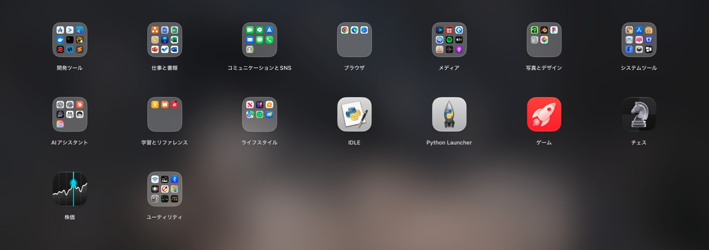
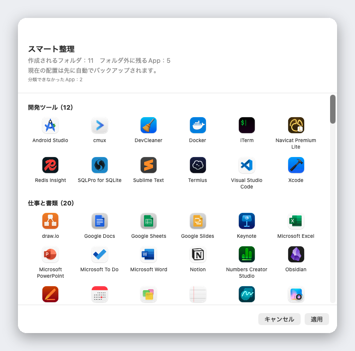

<div align="center">


# Liftoff

**macOS 26 で消えた Launchpad を、より速く、ウインドウのライブプレビュー付きで取り戻す。**

[](../LICENSE)


[](https://github.com/firstfu/Liftoff/releases/latest)

[](https://alternativeto.net/software/liftoff-by-firstfu/)

<a href="https://github.com/firstfu/Liftoff/releases/latest"><b>Liftoff.zip をダウンロード</b></a>
&nbsp;·&nbsp;
<code>brew install --cask firstfu/tap/liftoff</code>

[English](../README.md) · [繁體中文](README.zh-Hant.md) · [简体中文](README.zh-Hans.md) · **日本語** · [한국어](README.ko.md) · [Deutsch](README.de.md) · [Français](README.fr.md) · [Español](README.es.md) · [Português](README.pt-BR.md) · [Italiano](README.it.md) · [Русский](README.ru.md) · [Türkçe](README.tr.md) · [Nederlands](README.nl.md)


</div>

> [!NOTE]
> Liftoff には **macOS 26 以降**が必要です。**まだ Apple の公証を受けていない**ため、初回起動は macOS にブロックされます。「システム設定 → プライバシーとセキュリティ」を開き、**このまま開く**を一度クリックしてください（[手順](#インストール)）。コードはすべてここで公開しており、[各権限が何に使われるか](#権限の一覧)も下に記載しています。

## Liftoff とは

macOS 26 では、おなじみの Launchpad のグリッドが「App」リストに置き換えられました。ページ、フォルダ、ドラッグでの並べ替え、入力して検索——あのグリッドが好きだった方のために、Liftoff は macOS 26 向けにゼロから作り直し、厳しい性能基準を課しました。表示まで 3 ms 未満、ページ送りでコマ落ちなし、待機中の CPU 使用率は 0% です。

そのうえで、本家にはなかった機能を加えています。



## 機能

### ウインドウのライブプレビュー

実行中の App にポインタを重ねる（または選択して <kbd>Space</kbd> を押す）と、その App のウインドウがサムネールで表示されます。クリックすればそのウインドウへ直接移動でき、最小化したウインドウや別のデスクトップにあるウインドウも対象です。


### App もウインドウも見つかる検索

数文字入力するだけです。Liftoff は App 名、頭文字（`vsc` → Visual Studio Code）、中国語名のピンイン、そして開いているウインドウのタイトルに一致させます。


### スマート整理

ワンクリックで、すべての App を開発ツール、書類とオフィス、メディア、ユーティリティなどの分かりやすいフォルダに仕分けします。最初に全体のプレビューが表示され、「適用」を押すまでは何も変わりません。現在の配置は自動でバックアップされます。

仕分けは推測ではなく、1,000 以上の人気 Mac App（中国、日本、韓国、台湾で人気の App を含む）を収録した内蔵の対応表にもとづきます。AI もネットワークも使わず、結果は毎回同じです。載っていない App は [`AppCategories.json`](../Liftoff/Resources/AppCategories.json) に 1 行足すだけ。プルリクエストをお待ちしています。



### そのほかの機能

- グリッドから **App を Dock へドラッグ**できます。パネルは自動的に脇へ引っ込みます
- **以前の Launchpad の配置を読み込む**ことも、スマート整理でゼロから始めることもできます
- 好きな方法で開けます：ホットキー（デフォルトは <kbd>⌃⌘L</kbd>）、親指と 3 本指のピンチ、ホットコーナー、Dock のアイコン、`open liftoff://toggle`
- ページ、フォルダ（ドラッグで統合）、ドラッグでの並べ替え、キーボード操作
- ぼかし壁紙（最も省電力）、ライブぼかし、お好みの画像から背景を選べ、アイコンサイズ、ラベルサイズ、色も調整できます
- マルチディスプレイ対応 · App を非表示 · 関連ファイルごと App をアンインストール · 配置のバックアップと復元
- 13 言語に対応し、システムの言語に合わせて表示


## パフォーマンス

アプリ自身が実機で計測した値です（`scripts/selftest.sh` を実行すれば、お使いの Mac で同じ数値を再現できます）。

| | |
|---|---|
| パネルを開く | **< 3 ms** |
| 検索（1 キーストロークあたり） | **< 8 ms** |
| ページ送り | **コマ落ち 0** |
| 待機中 | **CPU 0%** |

## プライバシー

Liftoff は、アップデートの確認を求めない限り**ネットワーク接続を行いません**。ウインドウのサムネールはローカルで取得・表示され、Mac の外へ出ることはありません。
接続するのはアップデートの確認だけです。最新バージョン番号を読み取るために GitHub API へ 1 回リクエストを送ります。送信されるのは、**アップデートを確認…**をクリックしたとき、または設定で**毎週アップデートを自動確認**をオンにしたとき（デフォルトはオフ）だけです。あなたに関するデータは送信されません。

言葉だけで信じていただく必要はありません。各権限を使うコードは [`Liftoff/Preview`](../Liftoff/Preview)（画面収録：サムネール、アクセシビリティ：ウインドウの一覧取得と切り替え）と [`Liftoff/Services`](../Liftoff/Services)（ホットキー、ホットコーナー、トラックパッドのジェスチャ、および `UpdateChecker.swift` のアップデート確認）にあります。Little Snitch や LuLu でも確認できます。

### 非公開 API について

2 つの機能は、ドキュメント化されていない macOS の API を使っています。どちらも動的に読み込み、フォールバックを備えています。シンボルが消えてもクラッシュせず、その機能だけが自動的にオフになります。

- [`Liftoff/Preview/PrivateAPI.swift`](../Liftoff/Preview/PrivateAPI.swift) — SkyLight / HIServices。ウインドウの列挙と切り替えに使用（AltTab や Hammerspoon と同じ方法）
- [`Liftoff/Services/TrackpadGesture.swift`](../Liftoff/Services/TrackpadGesture.swift) — MultitouchSupport。ピンチジェスチャに使用（BetterTouchTool や MiddleClick と同じ方法）

## インストール

**Homebrew**: `brew install --cask firstfu/tap/liftoff` (`brew upgrade --cask liftoff`)

1. [Releases](https://github.com/firstfu/Liftoff/releases/latest) から `Liftoff.zip` をダウンロードして展開します。
2. `Liftoff.app` を `/Applications` に移動します。
3. 開きます。Apple の公証をまだ受けていないため、初回は macOS にブロックされます。**システム設定 → プライバシーとセキュリティ**を開き、下へスクロールして、*お使いのMacを保護するために“Liftoff”がブロックされました。*の横にある**このまま開く**をクリックしてください。
4. 求められる権限を許可します：**アクセシビリティ**（ウインドウの一覧取得と切り替え）と**画面収録とシステムオーディオ録音**（ウインドウのサムネール。ローカルのみ）。

**macOS 26 以降**、Apple シリコンと Intel の両方に対応しています。

### アップデート

新しい `Liftoff.app` で `/Applications` 内のものを置き換えてください。ビルドは ad-hoc 署名のため、macOS はバージョンごとに別の App として扱います。**このまま開く**を再度クリックし、画面収録とシステムオーディオ録音、アクセシビリティを再びオンにする必要があります（スイッチがオンに見えるのに動作しない場合は、**−** でリストから Liftoff を削除してから追加し直してください）。
新バージョンを知るには、メニューバーのメニューまたは設定で**アップデートを確認…**を選ぶか、設定で**毎週アップデートを自動確認**をオンにする（デフォルトはオフ）か、このページで **Watch → Custom → Releases** を使います。

## 権限の一覧

| 権限 | 必要？ | 用途 | 許可しない場合 |
|---|---|---|---|
| **画面収録とシステムオーディオ録音** | ウインドウのプレビューにのみ必要 | ウインドウのサムネールとタイトル（Mac 上でのみ取得・表示） | ウインドウのプレビューは使えません。ランチャーとしては引き続き使えます |
| **アクセシビリティ** | 任意 | 最小化されたウインドウの一覧表示と、クリックしたウインドウへの正確な切り替え | 最小化されたウインドウは一覧に出ず、切り替えの精度が下がります |

これ以外の権限は求めません。ランチャー本体には権限がまったく必要ありません。

## FAQ

<details>
<summary><b>macOS に「お使いのMacを保護するために“Liftoff”がブロックされました」と表示される</b></summary>

Liftoff はまだ Apple の公証を受けていません。「システム設定 → プライバシーとセキュリティ」を開き、下へスクロールして、メッセージの横にある**このまま開く**をクリックしてください。この操作はバージョンごとに 1 回だけです。
</details>

<details>
<summary><b>ウインドウのプレビューが表示されない、またはサムネールが出ない</b></summary>

「システム設定 → プライバシーとセキュリティ」で、Liftoff の**画面収録とシステムオーディオ録音**（プレビューに必要）と、必要に応じて**アクセシビリティ**（最小化されたウインドウ、正確な切り替え）がオンになっているか確認してください。スイッチがオンに見えるのに動作しない場合（アップデート後によくあります）は、**−** でリストから Liftoff を削除してから追加し直してください。リストに Liftoff が表示されない場合（macOS が自動で追加しないことがあります）は、リストの下の **+** をクリックし、「アプリケーション」から Liftoff を選んでください。
</details>

<details>
<summary><b>アップデートすると権限は失われますか？</b></summary>

はい。ad-hoc 署名のリリース版では、macOS がバージョンごとに別の App として扱うため、画面収録とシステムオーディオ録音、アクセシビリティを再度許可する必要があります。ご自身の証明書でビルドすれば避けられます。[`Config/Signing.xcconfig`](../Config/Signing.xcconfig) を参照してください。
</details>

<details>
<summary><b>ホットキー、ピンチ、ホットコーナーで開かない</b></summary>

ほかの App がすでにそのホットキーを使っている可能性があります（設定 → 開き方に警告が表示されます）。別のキーを選んでください。ピンチのジェスチャは、Liftoff の実行中だけ macOS 標準の「App」用ピンチを一時的にオフにし、オフにしたときや終了したときに元に戻します。`open liftoff://toggle` はいつでも使えます。
</details>

<details>
<summary><b>アンインストールするには？</b></summary>

メニューバーから Liftoff を終了し、`/Applications` から `Liftoff.app` を削除します。「ログイン時に開く」をオンにしていた場合は、「システム設定 → 一般 → ログイン項目」からも削除してください。設定も消すには、`defaults delete com.firstfu.Liftoff` を実行し、`~/Library/Caches/com.firstfu.Liftoff` を削除します。
</details>

## 似たツールとの違い

[LaunchNext](https://github.com/RoversX/LaunchNext) は、活発に開発されている優れたオープンソースプロジェクトです。公証済みで、従来の Launchpad のレイアウトを取り込め、あいまい検索やフォルダにも対応しています。それが必要なら、そちらをお使いください。Liftoff が加えているのは、実行中の App のウインドウのライブサムネール（クリックで切り替え、最小化されたものも対象）、ウインドウタイトルにも一致する検索、ワンクリックのスマート整理（内蔵の対応表を使い、AI は不使用、事前にプレビュー）、グリッドから Dock への App のドラッグ、そして再現できるパフォーマンスの数値です。現時点でのトレードオフは、LaunchNext は公証済みですが、Liftoff はまだ公証されていないことです。

## 対応言語

Liftoff はシステムの言語に合わせて表示します：English、繁體中文、简体中文、日本語、한국어、Deutsch、Français、Español、Português (Brasil)、Italiano、Русский、Türkçe、Nederlands。これ以外の言語では English で表示されます。

不自然な翻訳を見つけた、あるいは言語を追加したい場合は、インターフェースの文言がすべて 1 つのファイル [`Liftoff/Resources/Localizable.xcstrings`](../Liftoff/Resources/Localizable.xcstrings) にまとまっています。Xcode で開くか、プルリクエストを送ってください。

## ソースからビルド

Xcode 26 と [XcodeGen](https://github.com/yonaskolb/XcodeGen)（`brew install xcodegen`）が必要です。

```sh
git clone https://github.com/firstfu/Liftoff.git && cd Liftoff
xcodegen generate
xcodebuild -project Liftoff.xcodeproj -scheme Liftoff -configuration Release -derivedDataPath build build
open build/Build/Products/Release/Liftoff.app
```

Apple アカウントは不要で、ビルドはデフォルトで ad-hoc 署名されます。ご自身の証明書で署名する場合（再ビルドしてもアクセシビリティと画面収録の権限が保持されます）は、[`Config/Signing.xcconfig`](../Config/Signing.xcconfig) を参照してください。
テストは、`xcodebuild` コマンドの `build` を `test` に置き換えて実行します。`scripts/install.sh` は Release をビルドして `/Applications` にインストールし、ログイン時の起動を登録します。

## コントリビュート

無料のオープンソースで、開発者は 1 人です。[Issue](https://github.com/firstfu/Liftoff/issues/new/choose) もプルリクエストも大歓迎です。手軽な貢献方法は、翻訳の修正、載っていない App の [`AppCategories.json`](../Liftoff/Resources/AppCategories.json) への追加、macOS のバージョンを添えたバグ報告です。

## ライセンス

[GPLv3](../LICENSE)。自由に使用、研究、改変、共有できます。改変版を配布する場合は、同じライセンスでオープンソースのままにする必要があります。
