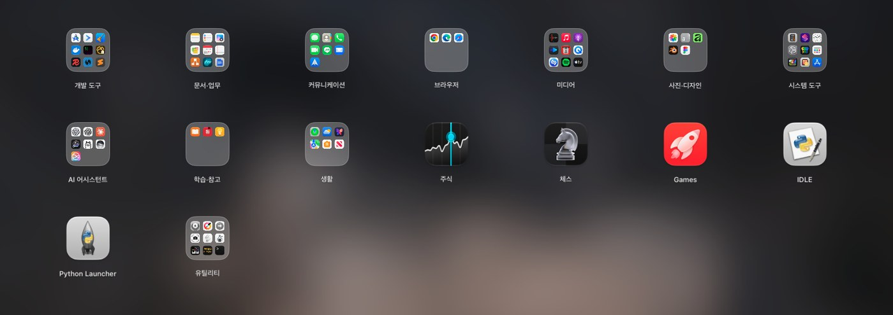
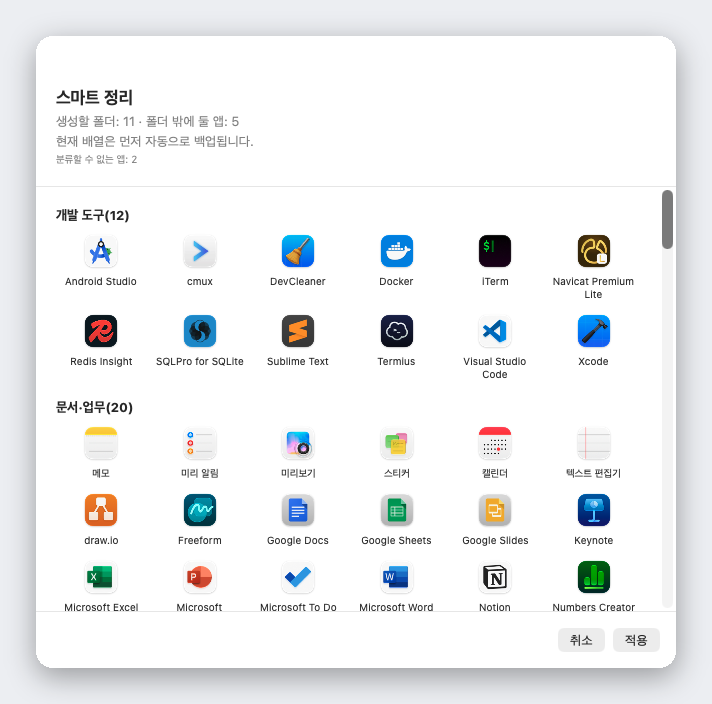

<div align="center">


# Liftoff

**macOS 26이 가져간 런치패드를 되살렸습니다. 더 빠르고, 실시간 윈도우 미리보기까지 더했습니다.**

[](../LICENSE)


[](https://github.com/firstfu/Liftoff/releases/latest)


[다운로드](https://github.com/firstfu/Liftoff/releases/latest)

[English](../README.md) · [繁體中文](README.zh-Hant.md) · [简体中文](README.zh-Hans.md) · [日本語](README.ja.md) · **한국어** · [Deutsch](README.de.md) · [Français](README.fr.md) · [Español](README.es.md) · [Português](README.pt-BR.md) · [Italiano](README.it.md) · [Русский](README.ru.md) · [Türkçe](README.tr.md) · [Nederlands](README.nl.md)


</div>

## Liftoff를 만든 이유

macOS 26은 익숙한 런치패드 격자를 "앱" 목록으로 바꿔 버렸습니다. 페이지를 넘기고, 폴더로 묶고, 드래그해서 정리하고, 입력하면 바로 검색되던 그 격자가 그리웠다면 Liftoff가 돌려드립니다. macOS 26에 맞춰 처음부터 새로 만들었고, 엄격한 성능 기준을 지킵니다. 3ms 안에 열리고, 페이지를 넘길 때 프레임이 떨어지지 않으며, 대기 중에는 CPU를 전혀 쓰지 않습니다(0%).

여기에 원래 런치패드에는 없던 기능을 더했습니다.



## 기능

### 실시간 윈도우 미리보기

실행 중인 앱 위에 포인터를 올려 두거나 <kbd>Space</kbd> 키를 누르면 해당 앱의 윈도우가 축소판으로 나타납니다. 하나를 클릭하면 그 윈도우로 바로 이동합니다. 최소화된 윈도우와 다른 데스크탑에 있는 윈도우도 포함됩니다.


### 앱과 윈도우를 *함께* 찾는 검색

몇 글자만 입력해 보세요. Liftoff는 앱 이름, 이니셜(`vsc` → Visual Studio Code), 중국어 앱 이름의 병음, 그리고 열려 있는 윈도우의 제목까지 찾아 줍니다.


### 스마트 정리

클릭 한 번으로 모든 앱을 알맞은 폴더(개발 도구, 문서 및 사무, 미디어, 유틸리티 등)로 나눕니다. 먼저 전체 미리보기를 보여 주고, 적용을 누르기 전까지는 아무것도 바뀌지 않으며, 현재 배열은 자동으로 백업됩니다.

추측이 아니라 내장된 1,000개 이상의 인기 Mac 앱 대조표를 기준으로 분류합니다(중국, 일본, 한국, 대만에서 인기 있는 앱 포함). AI도 네트워크도 쓰지 않으니 결과는 언제나 같습니다. 목록에 없는 앱은 [`AppCategories.json`](../Liftoff/Resources/AppCategories.json)에 한 줄만 추가하면 됩니다. 풀 리퀘스트를 환영합니다.



### 그 밖의 기능

- 격자에서 **앱을 Dock으로 바로 드래그**할 수 있으며, 패널은 알아서 비켜 줍니다
- **기존 런치패드 배열을 가져오거나**, 스마트 정리로 새로 시작할 수 있습니다
- 원하는 방식으로 열기: 단축키(기본값 <kbd>⌃⌘L</kbd>), 엄지와 세 손가락 핀치, 핫 코너, Dock 아이콘, 또는 `open liftoff://toggle`
- 페이지, 폴더(드래그해서 병합), 드래그로 순서 변경, 키보드 탐색
- 흐린 배경화면(전력 소모 최소), 실시간 블러, 또는 원하는 이미지 사용. 아이콘 크기, 레이블 크기, 색상 조절 가능
- 다중 디스플레이 지원 · 앱 숨기기 · 남은 파일까지 함께 앱 삭제 · 배열 백업 및 복원
- 시스템 언어를 따르는 13개 언어 지원


## 성능

앱이 실제 Mac에서 직접 측정한 값입니다(`scripts/selftest.sh`로 내 Mac에서도 같은 수치를 재현할 수 있습니다).

| | |
|---|---|
| 패널 열기 | **< 3 ms** |
| 검색, 키 입력당 | **< 8 ms** |
| 페이지 넘기기 | **프레임 드롭 0** |
| 대기 상태 | **CPU 0%** |

## 개인정보 보호

Liftoff는 **네트워크에 전혀 연결하지 않습니다.** 윈도우 축소판은 로컬에서 캡처해 표시하며 Mac 밖으로 나가지 않습니다.
말만 믿으실 필요는 없습니다. 각 권한을 사용하는 코드는 [`Liftoff/Preview`](../Liftoff/Preview)(화면 녹화: 축소판, 손쉬운 사용: 윈도우 목록 조회와 전환)와 [`Liftoff/Services`](../Liftoff/Services)(단축키, 핫 코너, 트랙패드 제스처)에 있습니다. Little Snitch나 LuLu로도 확인할 수 있습니다.

### 비공개 API에 대하여

두 가지 기능은 문서화되지 않은 macOS API를 사용합니다. 둘 다 동적으로 불러오며 대체 동작이 있어서, 해당 심볼이 사라지면 충돌하지 않고 그 기능만 스스로 꺼집니다.

- [`Liftoff/Preview/PrivateAPI.swift`](../Liftoff/Preview/PrivateAPI.swift): SkyLight / HIServices. 윈도우 열거와 전환에 사용합니다(AltTab, Hammerspoon과 같은 방식).
- [`Liftoff/Services/TrackpadGesture.swift`](../Liftoff/Services/TrackpadGesture.swift): MultitouchSupport. 핀치 제스처에 사용합니다(BetterTouchTool, MiddleClick과 같은 방식).

## 설치

**macOS 26 이상**이 필요합니다.

1. [Releases](https://github.com/firstfu/Liftoff/releases/latest)에서 `Liftoff.zip`을 내려받아 압축을 풉니다.
2. `Liftoff.app`을 `/Applications`로 옮깁니다.
3. 앱을 엽니다. 아직 Apple의 공증을 받지 않았기 때문에 처음에는 macOS가 실행을 막습니다. **시스템 설정 → 개인정보 보호 및 보안**을 열고 아래로 스크롤한 다음, *Mac을 보호하기 위해 ‘Liftoff’을(를) 차단했습니다.* 옆의 **그래도 열기**를 클릭하세요.
4. 요청하는 권한을 허용합니다. **손쉬운 사용**(윈도우 목록 조회 및 전환)과 **화면 및 시스템 오디오 녹음**(윈도우 축소판, 로컬 전용)입니다.

> 빌드는 ad-hoc 서명이므로, 업데이트할 때마다 macOS가 손쉬운 사용과 화면 및 시스템 오디오 녹음 권한을 다시 켜 달라고 요청합니다.

## 언어

Liftoff는 시스템 언어를 따릅니다. English, 繁體中文, 简体中文, 日本語, 한국어, Deutsch, Français, Español, Português (Brasil), Italiano, Русский, Türkçe, Nederlands를 지원하며, 그 밖의 언어는 영어로 표시됩니다.

어색한 번역을 발견했거나 새 언어를 추가하고 싶으신가요? 모든 인터페이스 문구는 [`Liftoff/Resources/Localizable.xcstrings`](../Liftoff/Resources/Localizable.xcstrings) 파일 하나에 있습니다. Xcode에서 열어 수정하거나 풀 리퀘스트를 보내 주세요.

## 소스에서 빌드하기

Xcode 26과 [XcodeGen](https://github.com/yonaskolb/XcodeGen)이 필요합니다(`brew install xcodegen`).

```sh
git clone https://github.com/firstfu/Liftoff.git && cd Liftoff
xcodegen generate
xcodebuild -project Liftoff.xcodeproj -scheme Liftoff -configuration Release -derivedDataPath build build
open build/Build/Products/Release/Liftoff.app
```

Apple 계정은 필요 없습니다. 기본적으로 ad-hoc 서명으로 빌드됩니다. 직접 만든 인증서로 서명하면(다시 빌드해도 macOS가 손쉬운 사용 / 화면 및 시스템 오디오 녹음 권한을 유지합니다) [`Config/Signing.xcconfig`](../Config/Signing.xcconfig)를 참고하세요.
테스트는 `xcodebuild` 명령에서 `build`를 `test`로 바꾸면 됩니다. `scripts/install.sh`는 Release 빌드 후 `/Applications`에 설치하고 로그인 시 자동 실행을 등록합니다.

## 기여하기

무료 오픈 소스이며 한 사람이 만들고 있습니다. [이슈](https://github.com/firstfu/Liftoff/issues/new/choose)와 풀 리퀘스트를 언제든 환영합니다. 가장 쉬운 방법은 번역을 고치거나, 빠진 앱을 [`AppCategories.json`](../Liftoff/Resources/AppCategories.json)에 추가하거나, macOS 버전과 함께 버그를 제보하는 것입니다.

## 라이선스

[GPLv3](../LICENSE). 자유롭게 사용하고, 연구하고, 수정하고, 공유할 수 있습니다. 수정본을 배포할 때는 같은 라이선스로 오픈 소스를 유지해야 합니다.
