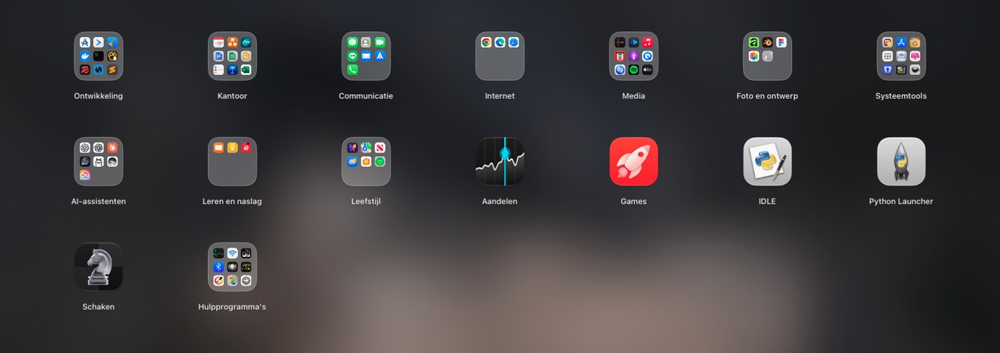
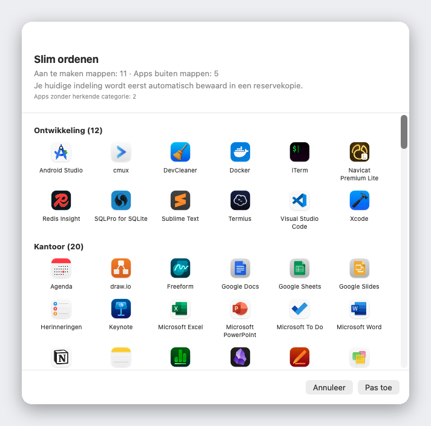

<div align="center">


# Liftoff

**De Launchpad die macOS 26 je afnam: terug, sneller, en met live voorvertoningen van vensters.**

[](../LICENSE)


[](https://github.com/firstfu/Liftoff/releases/latest)

[](https://alternativeto.net/software/liftoff-by-firstfu/)

[Download](https://github.com/firstfu/Liftoff/releases/latest)

[English](../README.md) · [繁體中文](README.zh-Hant.md) · [简体中文](README.zh-Hans.md) · [日本語](README.ja.md) · [한국어](README.ko.md) · [Deutsch](README.de.md) · [Français](README.fr.md) · [Español](README.es.md) · [Português](README.pt-BR.md) · [Italiano](README.it.md) · [Русский](README.ru.md) · [Türkçe](README.tr.md) · **Nederlands**

<a href="https://github.com/firstfu/Liftoff/releases/latest"><b>Download Liftoff.zip</b></a>
&nbsp;·&nbsp;
<code>brew install --cask firstfu/tap/liftoff</code>


</div>

> [!NOTE]
> Liftoff vereist **macOS 26 of nieuwer**. Het is **nog niet door Apple genotariseerd**, dus macOS blokkeert de eerste start: open Systeeminstellingen → Privacy en beveiliging en klik één keer op **Open toch** ([stappen](#installeren)). Alle code staat hier, en [waarvoor elke toegang dient](#toegang-in-het-kort) staat hieronder uitgeschreven.

## Waarom Liftoff

In macOS 26 maakte de lijst “Apps” een einde aan het vertrouwde Launchpad-raster. Miste je dat raster, met pagina's, mappen, slepen om te herschikken en typen om te zoeken? Liftoff brengt het terug. Het is van de grond af gebouwd voor macOS 26 en houdt zich aan harde prestatiegrenzen: het opent in minder dan 3 ms, laat tijdens het bladeren geen enkel frame vallen en gebruikt 0% CPU als je het niet gebruikt.

En daar bovenop krijg je wat het origineel nooit had.



## Functies

### Live voorvertoningen van vensters

Houd de aanwijzer boven een geopende app (of druk op <kbd>Spatiebalk</kbd> terwijl je erop staat) en de vensters verschijnen als miniaturen. Klik op een miniatuur om direct naar dat venster te gaan, ook als het is geminimaliseerd of op een ander bureaublad staat.


### Zoeken naar apps *en* vensters

Typ een paar letters. Liftoff vindt apps op naam, op beginletters (`vsc` → Visual Studio Code), op pinyin voor Chinese namen en op de titels van je geopende vensters.


### Slim ordenen

Met één klik komt je hele appverzameling in handige mappen terecht: Ontwikkeltools, Kantoor, Media, Hulpprogramma's… Je ziet eerst een volledige voorvertoning, er verandert niets totdat je op Pas toe klikt en je huidige indeling wordt automatisch bewaard in een reservekopie.

Het werkt met een ingebouwde tabel van meer dan 1.000 populaire Mac-apps (waaronder apps die populair zijn in China, Japan, Korea en Taiwan) en dus niet met gokwerk: geen AI, geen netwerk, elke keer hetzelfde resultaat. Mist er een app? Dat is één regel in [`AppCategories.json`](../Liftoff/Resources/AppCategories.json). Pull requests zijn welkom.



### En nog veel meer

- **Sleep een app naar het Dock** rechtstreeks vanuit het raster. Het paneel gaat vanzelf opzij
- **Importeer je oude Launchpad-indeling**, of begin met een schone lei en Slim ordenen
- Open het zoals jij wilt: met een toetscombinatie (standaard <kbd>⌃⌘L</kbd>), door met duim en drie vingers te knijpen, via een interactieve hoek, via het symbool in het Dock of met `open liftoff://toggle`
- Pagina's, mappen (sleep om samen te voegen), slepen om te herschikken, bediening met het toetsenbord
- Vervaagde achtergrond (zuinigst), live vervaging of je eigen afbeelding; instelbare symboolgrootte, labelgrootte en kleuren
- Ondersteunt meerdere beeldschermen · apps verbergen · apps verwijderen inclusief overgebleven bestanden · je indeling back-uppen en terugzetten
- 13 talen, volgens de taal van je systeem


## Prestaties

Gemeten op een echte Mac door de app zelf (met `scripts/selftest.sh` reproduceer je de cijfers op die van jou):

| | |
|---|---|
| Het paneel openen | **< 3 ms** |
| Zoeken, per toetsaanslag | **< 8 ms** |
| Bladeren | **0 verloren frames** |
| Inactief | **0% CPU** |

## Privacy

Liftoff maakt **geen netwerkverbindingen**, tenzij je vraagt om op updates te controleren. Miniaturen van vensters worden lokaal vastgelegd en getoond en verlaten je Mac nooit.
De enige verbinding die het kan maken is de updatecontrole: één verzoek aan de GitHub-API om het nieuwste versienummer te lezen, alleen verstuurd als je op **Zoek naar updates…** klikt of **Wekelijks op updates controleren** inschakelt in de instellingen (standaard uit). Er worden geen gegevens over jou verstuurd.

Je hoeft me niet op mijn woord te geloven: de code die elke toegang gebruikt staat in [`Liftoff/Preview`](../Liftoff/Preview) (Schermopname: miniaturen; Toegankelijkheid: vensters opvragen en wisselen) en in [`Liftoff/Services`](../Liftoff/Services) (toetscombinatie, interactieve hoek, trackpadgebaar en de updatecontrole in `UpdateChecker.swift`). Ook Little Snitch of LuLu bevestigt het.

### Een opmerking over privé-API's

Twee functies gebruiken ongedocumenteerde macOS-API's. Beide worden dynamisch geladen met een terugvaloptie: als de symbolen verdwijnen, schakelt de functie zichzelf uit in plaats van te crashen:

- [`Liftoff/Preview/PrivateAPI.swift`](../Liftoff/Preview/PrivateAPI.swift): SkyLight / HIServices, om vensters op te vragen en ertussen te wisselen (dezelfde aanpak als AltTab en Hammerspoon)
- [`Liftoff/Services/TrackpadGesture.swift`](../Liftoff/Services/TrackpadGesture.swift): MultitouchSupport, voor het knijpgebaar (dezelfde aanpak als BetterTouchTool en MiddleClick)

## Installeren

**Homebrew**: `brew install --cask firstfu/tap/liftoff` (`brew upgrade --cask liftoff`)

1. Download `Liftoff.zip` van [Releases](https://github.com/firstfu/Liftoff/releases/latest) en pak het uit.
2. Verplaats `Liftoff.app` naar `/Applications`.
3. Open de app. macOS blokkeert hem de eerste keer, omdat hij nog niet door Apple is genotariseerd: open **Systeeminstellingen → Privacy en beveiliging**, scrol omlaag en klik op **Open toch** naast *'Liftoff' is geblokkeerd om je Mac te beschermen.*
4. Geef de toegang waar de app om vraagt: **Toegankelijkheid** (vensters opvragen en wisselen) en **Scherm- en systeemaudio-opname** (miniaturen van vensters, alleen lokaal).

Vereist **macOS 26 of nieuwer**, Apple silicon of Intel.

### Updaten

Vervang `Liftoff.app` in `/Applications` door de nieuwe. Builds zijn ad-hoc ondertekend, dus macOS behandelt elke versie als een nieuwe app: je klikt één keer op **Open toch**, en Scherm- en systeemaudio-opname en Toegankelijkheid moeten opnieuw worden ingeschakeld (als een schakelaar aan lijkt te staan maar niets doet, verwijder Liftoff dan met **−** uit de lijst en voeg het opnieuw toe).
Om nieuwe versies te volgen: kies **Zoek naar updates…** in het menu in de menubalk of in de instellingen, schakel **Wekelijks op updates controleren** in de instellingen in (standaard uit), of gebruik **Watch → Custom → Releases** op deze pagina.

## Toegang in het kort

| Toegang | Nodig? | Waarom | Als je het overslaat |
|---|---|---|---|
| **Scherm- en systeemaudio-opname** | Alleen voor vensterweergaven | Miniaturen en titels van vensters (alleen op je Mac vastgelegd en getoond) | Geen vensterweergaven; Liftoff blijft gewoon een launcher |
| **Toegankelijkheid** | Optioneel | Geminimaliseerde vensters opvragen en precies naar het venster springen waarop je klikte | Geminimaliseerde vensters worden niet getoond; wisselen is minder nauwkeurig |

Er wordt niets anders gevraagd. De launcher zelf heeft helemaal geen toegang nodig.

## Veelgestelde vragen

<details>
<summary><b>macOS zegt "Liftoff is geblokkeerd om je Mac te beschermen"</b></summary>

Liftoff is nog niet door Apple genotariseerd. Open Systeeminstellingen → Privacy en beveiliging, scrol omlaag en klik op **Open toch** naast het bericht. Het is een eenmalige stap per versie.
</details>

<details>
<summary><b>Vensterweergaven verschijnen niet of tonen geen miniaturen</b></summary>

Controleer of **Scherm- en systeemaudio-opname** (nodig voor de weergaven) en eventueel **Toegankelijkheid** (geminimaliseerde vensters, nauwkeurig wisselen) voor Liftoff zijn ingeschakeld in Systeeminstellingen → Privacy en beveiliging. Als een schakelaar aan lijkt te staan maar niets werkt (vaak na een update), verwijder Liftoff dan met **−** uit de lijst en voeg het opnieuw toe. Staat Liftoff helemaal niet in de lijst (macOS voegt het niet altijd zelf toe), klik dan op **+** onder de lijst en kies Liftoff in Apps.
</details>

<details>
<summary><b>Raak ik de toegang kwijt als ik update?</b></summary>

Ja, bij de ad-hoc ondertekende releases: macOS ziet elke versie als een nieuwe app, dus Scherm- en systeemaudio-opname en Toegankelijkheid moeten opnieuw worden toegestaan. Zelf bouwen met je eigen certificaat voorkomt dit; zie [`Config/Signing.xcconfig`](../Config/Signing.xcconfig).
</details>

<details>
<summary><b>De toetscombinatie, het knijpgebaar of de interactieve hoek opent Liftoff niet</b></summary>

Mogelijk gebruikt een andere app de toetscombinatie al (Instellingen → Activering toont een waarschuwing); kies een andere. Het knijpgebaar schakelt het eigen knijpgebaar van macOS voor "Apps" tijdelijk uit zolang Liftoff draait en zet het terug als je het uitschakelt of de app afsluit. `open liftoff://toggle` werkt altijd.
</details>

<details>
<summary><b>Hoe verwijder ik het?</b></summary>

Sluit Liftoff af via de menubalk, verwijder `Liftoff.app` uit `/Applications` en haal het weg uit Systeeminstellingen → Algemeen → Inlogonderdelen en extensies als je *Open bij inloggen* had ingeschakeld. Om ook de instellingen te verwijderen: `defaults delete com.firstfu.Liftoff` en verwijder `~/Library/Caches/com.firstfu.Liftoff`.
</details>

## Wat het onderscheidt van vergelijkbare tools

[LaunchNext](https://github.com/RoversX/LaunchNext) is een goed, actief open-sourceproject: het is genotariseerd, importeert de oude Launchpad-indeling en heeft fuzzy zoeken en mappen. Als je dat nodig hebt, gebruik het dan. Wat Liftoff daaraan toevoegt: live miniaturen van de vensters van een draaiende app (klik om erheen te springen, ook geminimaliseerde), zoeken dat ook op venstertitels matcht, slim ordenen met één klik (ingebouwde opzoektabel, geen AI, eerst een voorbeeld), apps vanuit het raster naar het Dock slepen en prestatiecijfers die je zelf kunt reproduceren. De afweging op dit moment: LaunchNext is genotariseerd en Liftoff nog niet.

## Talen

Liftoff volgt de taal van je systeem: English, 繁體中文, 简体中文, 日本語, 한국어, Deutsch, Français, Español, Português (Brasil), Italiano, Русский, Türkçe en Nederlands. Alle andere talen vallen terug op Engels.

Een onhandige vertaling gezien, of wil je een taal toevoegen? Alle tekst van de interface staat in één bestand, [`Liftoff/Resources/Localizable.xcstrings`](../Liftoff/Resources/Localizable.xcstrings). Open het in Xcode, of stuur een pull request.

## Zelf bouwen

Vereist Xcode 26 en [XcodeGen](https://github.com/yonaskolb/XcodeGen) (`brew install xcodegen`).

```sh
git clone https://github.com/firstfu/Liftoff.git && cd Liftoff
xcodegen generate
xcodebuild -project Liftoff.xcodeproj -scheme Liftoff -configuration Release -derivedDataPath build build
open build/Build/Products/Release/Liftoff.app
```

Je hebt geen Apple-account nodig: builds worden standaard ad-hoc ondertekend. Wil je ondertekenen met je eigen certificaat (zodat macOS de toegang tot Toegankelijkheid en Scherm- en systeemaudio-opname behoudt na elke nieuwe build), kijk dan in [`Config/Signing.xcconfig`](../Config/Signing.xcconfig).
Tests draai je door in het `xcodebuild`-commando `build` te vervangen door `test`. `scripts/install.sh` bouwt de Release-versie, installeert die in `/Applications` en registreert het openen bij inloggen.

## Bijdragen

Gratis en open source, gemaakt door één persoon. [Issues](https://github.com/firstfu/Liftoff/issues/new/choose) en pull requests zijn van harte welkom. Zo help je het makkelijkst: verbeter een vertaling, voeg een ontbrekende app toe aan [`AppCategories.json`](../Liftoff/Resources/AppCategories.json) of meld een bug samen met je macOS-versie.

## Licentie

[GPLv3](../LICENSE). Je mag het vrij gebruiken, bestuderen, aanpassen en delen; aangepaste versies die je verspreidt moeten onder dezelfde licentie open source blijven.
