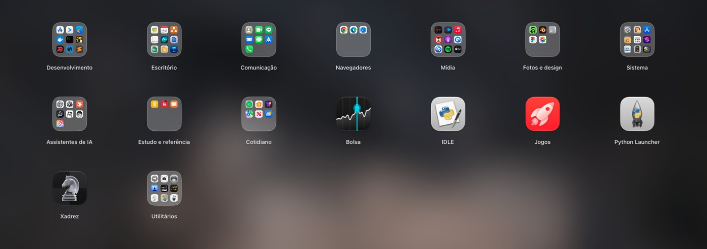
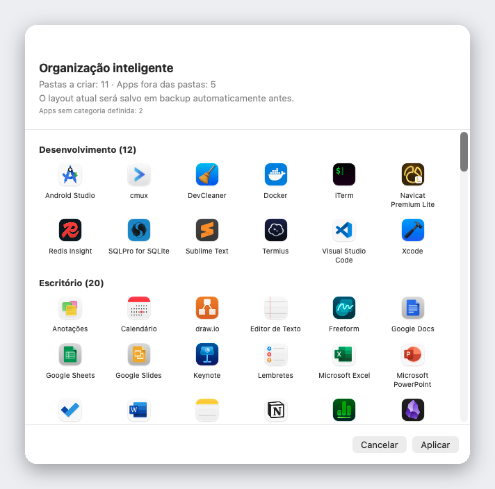

<div align="center">


# Liftoff

**O Launchpad que o macOS 26 tirou de você: de volta, mais rápido e com pré-visualização ao vivo das janelas.**

[](../LICENSE)


[](https://github.com/firstfu/Liftoff/releases/latest)


[Baixar](https://github.com/firstfu/Liftoff/releases/latest)

[English](../README.md) · [繁體中文](README.zh-Hant.md) · [简体中文](README.zh-Hans.md) · [日本語](README.ja.md) · [한국어](README.ko.md) · [Deutsch](README.de.md) · [Français](README.fr.md) · [Español](README.es.md) · **Português (Brasil)** · [Italiano](README.it.md) · [Русский](README.ru.md) · [Türkçe](README.tr.md) · [Nederlands](README.nl.md)


</div>

## Por que o Liftoff

O macOS 26 trocou a clássica grade do Launchpad pela lista "Apps". Se você gostava da grade, com páginas, pastas, arrastar para reorganizar e digitar para buscar, o Liftoff traz tudo de volta. Foi feito do zero para o macOS 26 e segue limites rígidos de desempenho: abre em menos de 3 ms, nunca perde um quadro ao trocar de página e usa 0% de CPU em repouso.

E ainda acrescenta o que o original nunca teve.



## Recursos

### Pré-visualização ao vivo das janelas

Deixe o cursor parado sobre um app aberto (ou pressione <kbd>Espaço</kbd> nele) e as janelas dele aparecem como miniaturas. Clique em uma para ir direto àquela janela, inclusive as minimizadas e as de outras mesas.


### Busca que encontra apps *e* janelas

Digite algumas letras. O Liftoff encontra pelo nome do app, pelas iniciais (`vsc` → Visual Studio Code), pelo pinyin de nomes em chinês e pelos títulos das suas janelas abertas.


### Organização inteligente

Um clique organiza toda a sua coleção de apps em pastas que fazem sentido: Ferramentas para Desenvolvedores, Documentos e Escritório, Mídia, Utilitários… Você vê uma pré-visualização completa antes, nada muda até você clicar em Aplicar, e o layout atual é salvo em backup automaticamente.

Ela usa uma tabela interna com mais de 1.000 apps populares de Mac (incluindo apps famosos na China, no Japão, na Coreia e em Taiwan), sem adivinhação: sem IA, sem rede, sempre com o mesmo resultado. Faltou um app? É só uma linha em [`AppCategories.json`](../Liftoff/Resources/AppCategories.json). Pull requests são bem-vindos.



### E mais

- **Arraste um app para o Dock** direto da grade; o painel sai da frente sozinho
- **Importe o layout do seu antigo Launchpad** ou comece do zero com a Organização inteligente
- Abra do jeito que preferir: atalho de teclado (<kbd>⌃⌘L</kbd> por padrão), pinça com o polegar e três dedos, um dos Cantos de Acesso Rápido, o ícone no Dock ou `open liftoff://toggle`
- Páginas, pastas (arraste para mesclar), arrastar para reordenar e navegação pelo teclado
- Imagem de fundo desfocada (menor consumo de energia), desfoque ao vivo ou uma imagem sua; tamanho dos ícones, tamanho dos rótulos e cores ajustáveis
- Compatível com várias telas · ocultar apps · desinstalar apps junto com os arquivos restantes · backup e restauração do layout
- 13 idiomas, seguindo o idioma do sistema


## Desempenho

Medido pelo próprio app em um Mac de verdade (`scripts/selftest.sh` reproduz os números no seu):

| | |
|---|---|
| Abrir o painel | **< 3 ms** |
| Busca, por tecla digitada | **< 8 ms** |
| Troca de página | **0 quadros perdidos** |
| Em repouso | **0% de CPU** |

## Privacidade

O Liftoff **não faz nenhuma conexão de rede**. As miniaturas das janelas são capturadas e exibidas localmente e nunca saem do seu Mac.
Não precisa acreditar na minha palavra: o código que usa cada permissão está em [`Liftoff/Preview`](../Liftoff/Preview) (Gravação do Áudio do Sistema e da Tela: miniaturas; Acessibilidade: listar e alternar janelas) e em [`Liftoff/Services`](../Liftoff/Services) (atalho de teclado, canto ativo, gesto no trackpad). O Little Snitch ou o LuLu também confirmam.

### Uma observação sobre APIs privadas

Dois recursos usam APIs não documentadas do macOS, ambas carregadas dinamicamente e com alternativa: se os símbolos desaparecerem, o recurso se desativa sozinho em vez de travar o app:

- [`Liftoff/Preview/PrivateAPI.swift`](../Liftoff/Preview/PrivateAPI.swift): SkyLight / HIServices, para listar e alternar janelas (a mesma abordagem do AltTab e do Hammerspoon)
- [`Liftoff/Services/TrackpadGesture.swift`](../Liftoff/Services/TrackpadGesture.swift): MultitouchSupport, para o gesto de pinça (a mesma abordagem do BetterTouchTool e do MiddleClick)

## Instalação

Requer **macOS 26 ou posterior**.

1. Baixe o `Liftoff.zip` em [Releases](https://github.com/firstfu/Liftoff/releases/latest) e descompacte.
2. Mova o `Liftoff.app` para `/Applications`.
3. Abra o app. Na primeira vez, o macOS vai bloqueá-lo, porque ele ainda não é notarizado pela Apple: abra **Ajustes do Sistema → Privacidade e Segurança**, role até o fim e clique em **Abrir Mesmo Assim** ao lado de *O app Liftoff foi bloqueado para proteger o Mac.*
4. Conceda as permissões solicitadas: **Acessibilidade** (listar e alternar janelas) e **Gravação do Áudio do Sistema e da Tela** (miniaturas das janelas, apenas localmente).

> Os builds têm assinatura ad-hoc, então o macOS pede que você reative Acessibilidade e Gravação do Áudio do Sistema e da Tela após cada atualização.

## Idiomas

O Liftoff segue o idioma do sistema: English, 繁體中文, 简体中文, 日本語, 한국어, Deutsch, Français, Español, Português (Brasil), Italiano, Русский, Türkçe e Nederlands. Qualquer outro idioma usa o inglês.

Encontrou uma tradução estranha ou quer adicionar um idioma? Todo o texto da interface fica em um único arquivo, [`Liftoff/Resources/Localizable.xcstrings`](../Liftoff/Resources/Localizable.xcstrings). Abra no Xcode ou envie um pull request.

## Compilar a partir do código-fonte

Requer Xcode 26 e [XcodeGen](https://github.com/yonaskolb/XcodeGen) (`brew install xcodegen`).

```sh
git clone https://github.com/firstfu/Liftoff.git && cd Liftoff
xcodegen generate
xcodebuild -project Liftoff.xcodeproj -scheme Liftoff -configuration Release -derivedDataPath build build
open build/Build/Products/Release/Liftoff.app
```

Não precisa de conta Apple: os builds têm assinatura ad-hoc por padrão. Para assinar com o seu próprio certificado (assim o macOS mantém as permissões de Acessibilidade e Gravação do Áudio do Sistema e da Tela entre recompilações), veja [`Config/Signing.xcconfig`](../Config/Signing.xcconfig).
Testes: troque `build` por `test` no comando `xcodebuild`. O `scripts/install.sh` compila em Release, instala em `/Applications` e registra a abertura no início da sessão.

## Contribuindo

Gratuito e de código aberto, feito por uma pessoa só. [Issues](https://github.com/firstfu/Liftoff/issues/new/choose) e pull requests são muito bem-vindos. As formas mais fáceis de ajudar: corrigir uma tradução, adicionar um app que falta em [`AppCategories.json`](../Liftoff/Resources/AppCategories.json) ou relatar um bug informando a sua versão do macOS.

## Licença

[GPLv3](../LICENSE). Você pode usar, estudar, modificar e compartilhar à vontade; versões modificadas que você distribuir devem continuar de código aberto sob a mesma licença.
