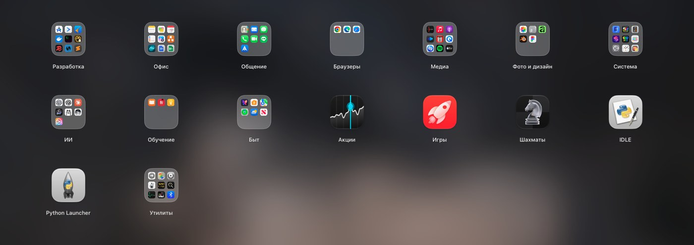
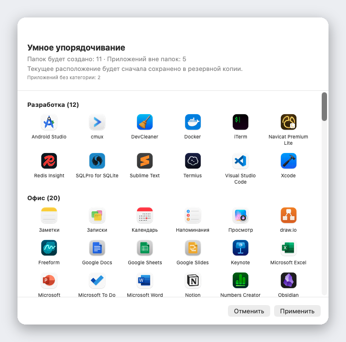

<div align="center">


# Liftoff

**Launchpad, который убрали из macOS 26, снова с вами — быстрее и с живым просмотром окон.**

[](../LICENSE)


[](https://github.com/firstfu/Liftoff/releases/latest)


[Скачать](https://github.com/firstfu/Liftoff/releases/latest)

[English](../README.md) · [繁體中文](README.zh-Hant.md) · [简体中文](README.zh-Hans.md) · [日本語](README.ja.md) · [한국어](README.ko.md) · [Deutsch](README.de.md) · [Français](README.fr.md) · [Español](README.es.md) · [Português](README.pt-BR.md) · [Italiano](README.it.md) · **Русский** · [Türkçe](README.tr.md) · [Nederlands](README.nl.md)

<a href="https://github.com/firstfu/Liftoff/releases/latest"><b>Скачать Liftoff.zip</b></a>


</div>

> [!NOTE]
> Для Liftoff нужна **macOS 26 или новее**. Приложение **пока не нотаризовано Apple**, поэтому macOS блокирует первый запуск: откройте Системные настройки → Конфиденциальность и безопасность и один раз нажмите **Все равно открыть** ([шаги](#установка)). Весь код открыт, а [зачем нужно каждое разрешение](#разрешения-вкратце) описано ниже.

## Зачем нужен Liftoff

В macOS 26 привычную сетку Launchpad заменили списком «Apps». Если вам нравились страницы, папки, перетаскивание значков и поиск прямо во время набора, Liftoff вернёт всё это. Он написан с нуля под macOS 26 и укладывается в жёсткие рамки по скорости: открывается быстрее чем за 3 мс, не роняет ни одного кадра при листании и в простое не нагружает процессор (0% CPU).

А ещё в нём есть то, чего никогда не было в оригинале.



## Возможности

### Живой просмотр окон

Наведите указатель на запущенное приложение (или нажмите на нём <kbd>Пробел</kbd>), и его окна появятся в виде миниатюр. Щёлкните по миниатюре, чтобы сразу перейти к нужному окну, в том числе к свёрнутому или находящемуся на другом рабочем столе.


### Поиск, который находит приложения *и* окна

Введите несколько букв. Liftoff ищет по названиям приложений, по инициалам (`vsc` → Visual Studio Code), по пиньиню для китайских названий и по заголовкам ваших открытых окон.


### Умное упорядочивание

Одним щелчком вся коллекция приложений раскладывается по понятным папкам: «Инструменты разработчика», «Документы и офис», «Медиа», «Утилиты»… Сначала вы видите полный предпросмотр, ничего не меняется, пока вы не нажмёте «Применить», а текущее расположение автоматически сохраняется в резервной копии.

Работает оно по встроенной таблице из более чем 1000 популярных приложений для Mac (включая популярные в Китае, Японии, Корее и на Тайване), а не по догадкам: без ИИ, без сети и с одним и тем же результатом каждый раз. Нет вашего приложения? Это одна строка в [`AppCategories.json`](../Liftoff/Resources/AppCategories.json), пул-реквесты приветствуются.



### И не только

- **Перетаскивайте приложение в Dock** прямо из сетки: панель сама уберётся с дороги
- **Импортируйте прежнее расположение Launchpad** или начните с чистого листа с помощью умного упорядочивания
- Открывайте как удобно: горячая клавиша (по умолчанию <kbd>⌃⌘L</kbd>), щипок большим и тремя пальцами, активный угол, значок в Dock или `open liftoff://toggle`
- Страницы, папки (перетащите, чтобы объединить), перетаскивание для изменения порядка, управление с клавиатуры
- Размытые обои (минимум энергии), живое размытие или ваше собственное изображение; настраиваемые размер значков, размер подписей и цвета
- Поддержка нескольких дисплеев · скрытие приложений · удаление приложений вместе с остаточными файлами · резервное копирование и восстановление расположения
- 13 языков, язык выбирается по системному


## Производительность

Замеры сделаны самим приложением на реальном Mac (`scripts/selftest.sh` воспроизведёт цифры на вашем):

| | |
|---|---|
| Открытие панели | **< 3 мс** |
| Поиск, на одно нажатие клавиши | **< 8 мс** |
| Листание | **0 потерянных кадров** |
| Простой | **0% CPU** |

## Конфиденциальность

Liftoff **не обращается к сети**, пока вы сами не попросите проверить обновления. Миниатюры окон создаются и показываются локально и никогда не покидают ваш Mac.
Единственное возможное подключение — проверка обновлений: один запрос к API GitHub, чтобы узнать номер последней версии. Он отправляется только когда вы нажимаете **Проверить наличие обновлений…** или включаете **Проверять обновления раз в неделю** в настройках (по умолчанию выключено). Никаких данных о вас не передаётся.

Не верьте мне на слово: код, использующий каждое разрешение, лежит в [`Liftoff/Preview`](../Liftoff/Preview) (запись экрана: миниатюры; универсальный доступ: список окон и переключение между ними) и в [`Liftoff/Services`](../Liftoff/Services) (горячая клавиша, активный угол, жест на трекпаде и проверка обновлений в `UpdateChecker.swift`). Little Snitch или LuLu тоже это подтвердят.

### О закрытых API

Две функции используют недокументированные API macOS. Оба подгружаются динамически и имеют запасной вариант: если символы исчезнут, функция сама отключится, а не приведёт к сбою:

- [`Liftoff/Preview/PrivateAPI.swift`](../Liftoff/Preview/PrivateAPI.swift): SkyLight / HIServices, для перечисления окон и переключения между ними (тот же подход, что в AltTab и Hammerspoon)
- [`Liftoff/Services/TrackpadGesture.swift`](../Liftoff/Services/TrackpadGesture.swift): MultitouchSupport, для жеста щипка (тот же подход, что в BetterTouchTool и MiddleClick)

## Установка

1. Скачайте `Liftoff.zip` со страницы [Releases](https://github.com/firstfu/Liftoff/releases/latest) и распакуйте архив.
2. Переместите `Liftoff.app` в `/Applications`.
3. Откройте приложение. В первый раз macOS заблокирует его, потому что оно ещё не прошло нотаризацию Apple: откройте **Системные настройки → Конфиденциальность и безопасность**, прокрутите вниз и нажмите **Все равно открыть** рядом с сообщением *Файл «Liftoff» заблокирован для защиты Вашего Mac.*
4. Выдайте запрошенные разрешения: **Универсальный доступ** (список окон и переключение между ними) и **Запись экрана и системного звука** (миниатюры окон, только локально).

Требуется **macOS 26 или новее**, Apple silicon или Intel.

### Обновление

Замените `Liftoff.app` в `/Applications` новой версией. Сборки подписаны ad-hoc, поэтому macOS считает каждую версию новым приложением: нужно один раз нажать **Все равно открыть**, а «Запись экрана и системного звука» и «Универсальный доступ» придётся включить заново (если переключатель выглядит включённым, но ничего не работает, удалите Liftoff из списка кнопкой **−** и добавьте снова).
Чтобы узнавать о новых версиях: выберите **Проверить наличие обновлений…** в меню в строке меню или в настройках, включите **Проверять обновления раз в неделю** в настройках (по умолчанию выключено) или используйте **Watch → Custom → Releases** на этой странице.

## Разрешения вкратце

| Разрешение | Нужно? | Зачем | Если пропустить |
|---|---|---|---|
| **Запись экрана и системного звука** | Только для просмотра окон | Миниатюры и заголовки окон (создаются и показываются только на вашем Mac) | Нет просмотра окон; Liftoff остаётся панелью запуска |
| **Универсальный доступ** | По желанию | Список свёрнутых окон и переход именно к тому окну, по которому вы щёлкнули | Свёрнутые окна не показываются; переключение менее точное |

Больше ничего не запрашивается. Для самой панели запуска разрешения не нужны вообще.

## Вопросы и ответы

<details>
<summary><b>macOS пишет: «Файл Liftoff заблокирован для защиты Вашего Mac»</b></summary>

Liftoff пока не нотаризован Apple. Откройте Системные настройки → Конфиденциальность и безопасность, прокрутите вниз и нажмите **Все равно открыть** рядом с этим сообщением. Это однократный шаг для каждой версии.
</details>

<details>
<summary><b>Просмотр окон не появляется или без миниатюр</b></summary>

Убедитесь, что для Liftoff включены **Запись экрана и системного звука** (нужна для просмотра) и, по желанию, **Универсальный доступ** (свёрнутые окна, точное переключение) в Системных настройках → Конфиденциальность и безопасность. Если переключатель выглядит включённым, но ничего не работает (так часто бывает после обновления), удалите Liftoff из списка кнопкой **−** и добавьте снова.
</details>

<details>
<summary><b>Пропадают ли разрешения при обновлении?</b></summary>

Да, для релизов с подписью ad-hoc: macOS считает каждую версию новым приложением, поэтому «Запись экрана и системного звука» и «Универсальный доступ» нужно разрешить заново. Если собрать приложение самостоятельно со своим сертификатом, этого не произойдёт; см. [`Config/Signing.xcconfig`](../Config/Signing.xcconfig).
</details>

<details>
<summary><b>Горячая клавиша, жест щипка или активный угол не открывают Liftoff</b></summary>

Возможно, горячая клавиша уже занята другим приложением (в настройках, на вкладке «Запуск», появится предупреждение); выберите другую. Жест щипка временно отключает встроенный жест macOS для «Приложений», пока Liftoff запущен, и возвращает его, когда вы выключаете жест или завершаете приложение. `open liftoff://toggle` работает всегда.
</details>

<details>
<summary><b>Как удалить приложение?</b></summary>

Завершите Liftoff из строки меню, удалите `Liftoff.app` из `/Applications` и уберите его из Системных настроек → Основные → Объекты входа и расширения, если вы включали *Открывать при входе*. Чтобы удалить и его настройки: `defaults delete com.firstfu.Liftoff` и удалите `~/Library/Caches/com.firstfu.Liftoff`.
</details>

## Чем он отличается от похожих приложений

[LaunchNext](https://github.com/RoversX/LaunchNext) — хороший, активно развивающийся проект с открытым кодом: он нотаризован, импортирует раскладку старого Launchpad, умеет нечёткий поиск и папки. Если вам нужно именно это, пользуйтесь им. Что добавляет Liftoff: живые миниатюры окон запущенного приложения (щёлкните, чтобы перейти к окну, включая свёрнутые), поиск, который находит и заголовки окон, умное упорядочивание в один клик (встроенная таблица соответствий, без ИИ, сначала предпросмотр), перетаскивание приложений из сетки в Dock и показатели производительности, которые можно воспроизвести. Пока что есть и компромисс: LaunchNext нотаризован, а Liftoff ещё нет.

## Языки

Liftoff использует язык вашей системы: English, 繁體中文, 简体中文, 日本語, 한국어, Deutsch, Français, Español, Português (Brasil), Italiano, Русский, Türkçe и Nederlands. Для любого другого языка интерфейс будет на английском.

Заметили неудачный перевод или хотите добавить язык? Весь текст интерфейса лежит в одном файле, [`Liftoff/Resources/Localizable.xcstrings`](../Liftoff/Resources/Localizable.xcstrings): откройте его в Xcode или пришлите пул-реквест.

## Сборка из исходников

Нужны Xcode 26 и [XcodeGen](https://github.com/yonaskolb/XcodeGen) (`brew install xcodegen`).

```sh
git clone https://github.com/firstfu/Liftoff.git && cd Liftoff
xcodegen generate
xcodebuild -project Liftoff.xcodeproj -scheme Liftoff -configuration Release -derivedDataPath build build
open build/Build/Products/Release/Liftoff.app
```

Аккаунт Apple не нужен: по умолчанию сборки подписываются ad-hoc. Чтобы подписать своим сертификатом (тогда macOS сохранит разрешения «Универсальный доступ» и «Запись экрана» между пересборками), смотрите [`Config/Signing.xcconfig`](../Config/Signing.xcconfig).
Тесты: замените `build` на `test` в команде `xcodebuild`. `scripts/install.sh` собирает Release, устанавливает в `/Applications` и включает запуск при входе в систему.

## Участие в проекте

Свободный проект с открытым кодом, который делает один человек. [Issues](https://github.com/firstfu/Liftoff/issues/new/choose) и пул-реквесты очень приветствуются. Проще всего помочь так: поправить перевод, добавить недостающее приложение в [`AppCategories.json`](../Liftoff/Resources/AppCategories.json) или сообщить об ошибке, указав версию macOS.

## Лицензия

[GPLv3](../LICENSE). Вы можете свободно использовать, изучать, изменять и распространять программу; распространяемые вами изменённые версии должны оставаться открытыми под той же лицензией.
