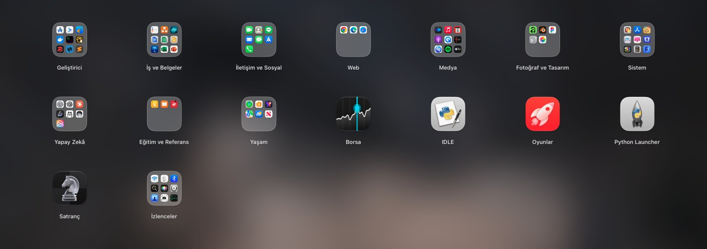
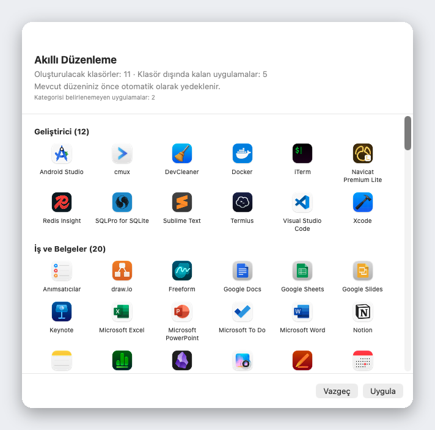

<div align="center">


# Liftoff

**macOS 26'nın elinizden aldığı Launchpad geri döndü: daha hızlı ve canlı pencere önizlemeleriyle.**

[](../LICENSE)


[](https://github.com/firstfu/Liftoff/releases/latest)


[İndir](https://github.com/firstfu/Liftoff/releases/latest)

[English](../README.md) · [繁體中文](README.zh-Hant.md) · [简体中文](README.zh-Hans.md) · [日本語](README.ja.md) · [한국어](README.ko.md) · [Deutsch](README.de.md) · [Français](README.fr.md) · [Español](README.es.md) · [Português](README.pt-BR.md) · [Italiano](README.it.md) · [Русский](README.ru.md) · **Türkçe** · [Nederlands](README.nl.md)


</div>

## Neden Liftoff

macOS 26, klasik Launchpad ızgarasının yerine "Uygulamalar" listesini getirdi. Sayfalar, klasörler, sürükleyip yeniden düzenleme ve yazarak arama düzenini seviyorsanız Liftoff bunu size geri veriyor. Üstelik macOS 26 için sıfırdan yazıldı ve sıkı performans sınırlarına bağlı: 3 ms'den kısa sürede açılıyor, sayfa çevirirken tek kare bile atlamıyor ve boştayken %0 CPU kullanıyor.

Sonra orijinalinde hiç olmayan özellikleri ekliyor.



## Özellikler

### Canlı pencere önizlemeleri

İmleci çalışan bir uygulamanın üzerinde bekletin (ya da uygulamayı seçip <kbd>Boşluk</kbd> tuşuna basın); pencereleri küçük resimler olarak belirir. Birine tıklayın, doğrudan o pencereye geçin. Dock'a küçültülmüş pencereler ve başka masaüstlerindeki pencereler de dahil.


### Uygulamaları *ve* pencereleri bulan arama

Birkaç harf yazmanız yeterli. Liftoff uygulama adlarını, baş harfleri (`vsc` → Visual Studio Code), Çince adlar için pinyin'i ve açık pencerelerinizin başlıklarını eşleştirir.


### Akıllı Düzenleme

Tek tıkla tüm uygulama koleksiyonunuz mantıklı klasörlere ayrılır: Geliştirici Araçları, Belgeler ve Ofis, Medya, İzlenceler… Önce tam bir önizleme görürsünüz, Uygula'ya basana kadar hiçbir şey değişmez ve mevcut düzeniniz otomatik olarak yedeklenir.

Tahmine değil, 1.000'den fazla popüler Mac uygulamasını (Çin, Japonya, Kore ve Tayvan'da popüler olanlar dahil) içeren yerleşik bir tabloya dayanır: yapay zekâ yok, ağ yok, sonuç her seferinde aynı. Bir uygulama eksik mi? [`AppCategories.json`](../Liftoff/Resources/AppCategories.json) dosyasına tek satır eklemek yeterli. Pull request'ler memnuniyetle karşılanır.



### Ve daha fazlası

- **Bir uygulamayı doğrudan ızgaradan Dock'a sürükleyin.** Panel kendiliğinden yolunuzdan çekilir
- **Eski Launchpad düzeninizi içe aktarın** ya da Akıllı Düzenleme ile sıfırdan başlayın
- Dilediğiniz gibi açın: kısayol tuşu (varsayılan <kbd>⌃⌘L</kbd>), başparmak ve üç parmakla sıkıştırma, sıcak köşe, Dock simgesi ya da `open liftoff://toggle`
- Sayfalar, klasörler (birleştirmek için sürükleyin), sürükleyerek sıralama, klavyeyle gezinme
- Bulanık duvar kâğıdı (en düşük güç tüketimi), canlı bulanıklık ya da kendi görseliniz; ayarlanabilir simge boyutu, etiket boyutu ve renkler
- Çoklu ekran desteği · uygulamaları gizleme · artıklarıyla birlikte uygulama silme · düzeni yedekleme ve geri yükleme
- Sistem dilinizi izleyen 13 dil desteği


## Performans

Uygulamanın kendisi tarafından gerçek bir Mac'te ölçüldü (`scripts/selftest.sh` aynı rakamları sizin Mac'inizde de üretir):

| | |
|---|---|
| Paneli açma | **< 3 ms** |
| Arama, tuş başına | **< 8 ms** |
| Sayfa çevirme | **0 atlanan kare** |
| Boşta | **%0 CPU** |

## Gizlilik

Liftoff **hiçbir ağ bağlantısı kurmaz**. Pencere küçük resimleri yerelde yakalanır, yerelde gösterilir ve Mac'inizden asla çıkmaz.
Sözüme güvenmeyin: her izni kullanan kod açıkta duruyor. [`Liftoff/Preview`](../Liftoff/Preview) içinde (Ekran Kaydı: küçük resimler; Erişilebilirlik: pencereleri listeleme ve değiştirme) ve [`Liftoff/Services`](../Liftoff/Services) içinde (kısayol tuşu, sıcak köşe, izleme dörtgeni hareketi). Little Snitch ya da LuLu da bunu doğrulayacaktır.

### Özel API'ler hakkında bir not

İki özellik, belgelenmemiş macOS API'lerini kullanır. İkisi de dinamik olarak yüklenir ve yedek yolu vardır: semboller ortadan kalkarsa özellik çökmek yerine kendini kapatır.

- [`Liftoff/Preview/PrivateAPI.swift`](../Liftoff/Preview/PrivateAPI.swift): pencereleri listelemek ve aralarında geçiş yapmak için SkyLight / HIServices (AltTab ve Hammerspoon ile aynı yaklaşım)
- [`Liftoff/Services/TrackpadGesture.swift`](../Liftoff/Services/TrackpadGesture.swift): sıkıştırma hareketi için MultitouchSupport (BetterTouchTool ve MiddleClick ile aynı yaklaşım)

## Kurulum

**macOS 26 veya üzeri** gerekir.

1. [Releases](https://github.com/firstfu/Liftoff/releases/latest) sayfasından `Liftoff.zip` dosyasını indirin ve arşivden çıkarın.
2. `Liftoff.app` dosyasını `/Applications` klasörüne taşıyın.
3. Açın. Apple tarafından henüz noter onaylı olmadığı için macOS ilk seferde engelleyecektir: **Sistem Ayarları → Gizlilik ve Güvenlik** bölümünü açın, aşağı kaydırın ve *“Liftoff”, Mac’inizi korumak için engellendi.* iletisinin yanındaki **Yine de Aç** düğmesine tıklayın.
4. İstediği izinleri verin: **Erişilebilirlik** (pencereleri listelemek ve değiştirmek için) ve **Ekran ve Sistem Sesi Kaydı** (pencere küçük resimleri için, yalnızca yerel).

> Derlemeler ad-hoc imzalıdır; bu yüzden macOS, her güncellemeden sonra Erişilebilirlik ve Ekran ve Sistem Sesi Kaydı izinlerini yeniden etkinleştirmenizi ister.

## Diller

Liftoff sistem dilinizi izler: English, 繁體中文, 简体中文, 日本語, 한국어, Deutsch, Français, Español, Português (Brasil), Italiano, Русский, Türkçe ve Nederlands. Diğer tüm diller İngilizceye döner.

Kulağa tuhaf gelen bir çeviri mi gördünüz ya da yeni bir dil eklemek mi istiyorsunuz? Tüm arayüz metinleri tek bir dosyada duruyor: [`Liftoff/Resources/Localizable.xcstrings`](../Liftoff/Resources/Localizable.xcstrings). Xcode'da açın ya da pull request gönderin.

## Kaynaktan derleme

Xcode 26 ve [XcodeGen](https://github.com/yonaskolb/XcodeGen) gerekir (`brew install xcodegen`).

```sh
git clone https://github.com/firstfu/Liftoff.git && cd Liftoff
xcodegen generate
xcodebuild -project Liftoff.xcodeproj -scheme Liftoff -configuration Release -derivedDataPath build build
open build/Build/Products/Release/Liftoff.app
```

Apple hesabı gerekmez: derlemeler varsayılan olarak ad-hoc imzalanır. Kendi sertifikanızla imzalamak (böylece macOS yeniden derlemelerde Erişilebilirlik / Ekran ve Sistem Sesi Kaydı izinlerini korur) için [`Config/Signing.xcconfig`](../Config/Signing.xcconfig) dosyasına bakın.
Testler: `xcodebuild` komutunda `build` yerine `test` yazın. `scripts/install.sh` Release derler, `/Applications` içine kurar ve oturum açıldığında başlatmayı kaydeder.

## Katkıda bulunma

Özgür ve açık kaynak, tek kişi tarafından geliştiriliyor. [Issue](https://github.com/firstfu/Liftoff/issues/new/choose) ve pull request'ler çok makbule geçer. Yardım etmenin en kolay yolları: bir çeviriyi düzeltmek, eksik bir uygulamayı [`AppCategories.json`](../Liftoff/Resources/AppCategories.json) dosyasına eklemek ya da macOS sürümünüzü belirterek bir hata bildirmek.

## Lisans

[GPLv3](../LICENSE). Kullanmakta, incelemekte, değiştirmekte ve paylaşmakta özgürsünüz; dağıttığınız değiştirilmiş sürümler aynı lisansla açık kaynak kalmak zorundadır.
