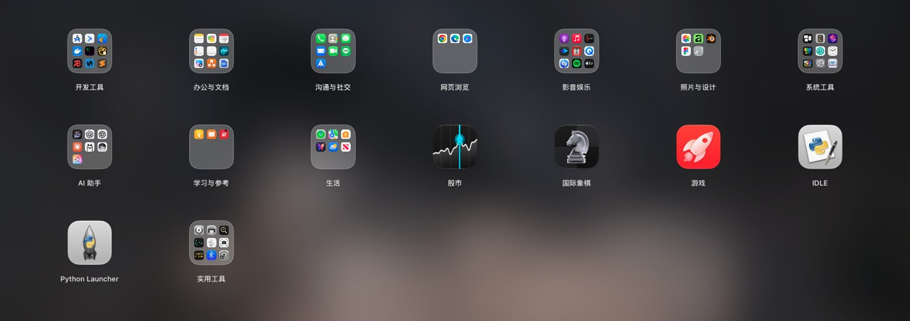
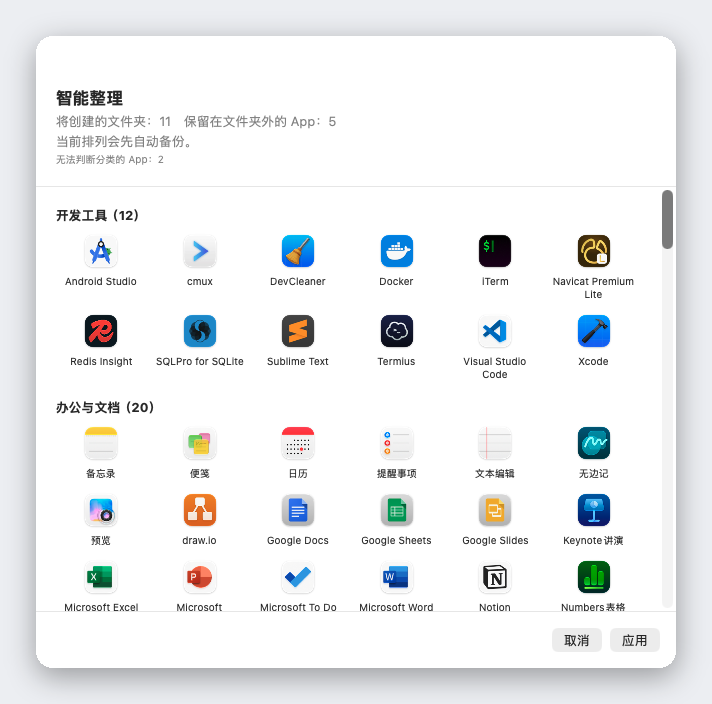

<div align="center">


# Liftoff

**macOS 26 拿走的启动台，现在回来了：更快，还能实时预览窗口。**

[](../LICENSE)


[](https://github.com/firstfu/Liftoff/releases/latest)


<a href="https://github.com/firstfu/Liftoff/releases/latest"><b>下载 Liftoff.zip</b></a>

[English](../README.md) · [繁體中文](README.zh-Hant.md) · **简体中文** · [日本語](README.ja.md) · [한국어](README.ko.md) · [Deutsch](README.de.md) · [Français](README.fr.md) · [Español](README.es.md) · [Português](README.pt-BR.md) · [Italiano](README.it.md) · [Русский](README.ru.md) · [Türkçe](README.tr.md) · [Nederlands](README.nl.md)


</div>

> [!NOTE]
> Liftoff 需要 **macOS 26 或更高版本**。它**尚未经过 Apple 公证**，所以 macOS 会阻止第一次打开：请打开“系统设置 → 隐私与安全”，点按一次 **仍要打开**（[步骤](#安装)）。所有代码都公开在这里，[各项权限分别用在哪里](#权限一览)也写在下面。

## 为什么选择 Liftoff

macOS 26 用“App”列表取代了经典的启动台网格。如果你喜欢那个网格，喜欢分页、文件夹、拖动排序、打字即搜，Liftoff 就把它还给你。它专为 macOS 26 从零写成，并且守着严格的性能底线：打开不到 3 ms，翻页不掉一帧，闲置时 CPU 占用 0%。

而且，它还多了原版从来没有的东西。



## 功能

### 实时窗口预览

把指针停在正在运行的 App 上（或选中后按<kbd>空格键</kbd>），它的所有窗口就会以缩略图显示。点按任意一个，即可直接跳到该窗口，最小化的窗口和其他桌面上的窗口也不例外。


### 同时搜索 App 和窗口

随手敲几个字母。Liftoff 会匹配 App 名称、首字母缩写（`vsc` → Visual Studio Code）、中文名称的拼音，以及你已打开窗口的标题。


### 智能整理

一键把你的全部 App 归入合理的文件夹：开发工具、文档与办公、媒体、实用工具……整理前会先给你完整预览，点按“应用”之前不会有任何改动，当前的排列也会自动备份。

它依据内置的对照表分类，收录 1,000 多款常用 Mac App（包括在中国大陆、日本、韩国和台湾地区流行的 App），不靠猜测：不用 AI，不联网，每次结果都一样。少了哪个 App？在 [`AppCategories.json`](../Liftoff/Resources/AppCategories.json) 里加一行就行，欢迎提交 pull request。



### 还有更多

- **直接从网格把 App 拖进程序坞**，面板会自动收起让路
- **导入旧的启动台排列**，或用智能整理重新开始
- 随你喜欢的方式打开：快捷键（默认 <kbd>⌃⌘L</kbd>）、拇指加三指捏合、触发角、程序坞图标，或 `open liftoff://toggle`
- 分页、文件夹（拖动即可合并）、拖动排序、键盘导航
- 模糊壁纸（最省电）、实时模糊，或你自己的图片；图标大小、标签大小和颜色都可调整
- 支持多显示器 · 隐藏 App · 卸载 App 并清理残留文件 · 备份与还原排列
- 13 种语言，跟随系统语言


## 性能

由 App 自己在真实的 Mac 上测得（`scripts/selftest.sh` 可以在你的机器上重现这些数字）：

| | |
|---|---|
| 打开面板 | **< 3 ms** |
| 搜索，每次按键 | **< 8 ms** |
| 翻页 | **0 掉帧** |
| 闲置 | **0% CPU** |

## 隐私

Liftoff **不会建立任何网络连接**，除非你要求它检查更新。窗口缩略图只在本机截取和显示，绝不会离开你的 Mac。
它唯一可能发起的连接就是检查更新：向 GitHub API 发出一次请求，读取最新的版本号，并且只有在你点按 **检查更新…**，或在设置中打开 **每周自动检查更新**（默认关闭）时才会发出。不会发送任何关于你的数据。

不必只听我说：每项权限对应的代码都摆在这里，见 [`Liftoff/Preview`](../Liftoff/Preview)（录屏：缩略图；无障碍：列出和切换窗口）与 [`Liftoff/Services`](../Liftoff/Services)（快捷键、触发角、触控板手势，以及 `UpdateChecker.swift` 中的检查更新）。用 Little Snitch 或 LuLu 也能验证。

### 关于私有 API

有两项功能用到了 macOS 未公开的 API，均为动态加载并带有 fallback：如果这些符号消失，该功能会自动关闭，而不是崩溃。

- [`Liftoff/Preview/PrivateAPI.swift`](../Liftoff/Preview/PrivateAPI.swift)：SkyLight / HIServices，用于枚举和切换窗口（做法与 AltTab、Hammerspoon 相同）
- [`Liftoff/Services/TrackpadGesture.swift`](../Liftoff/Services/TrackpadGesture.swift)：MultitouchSupport，用于捏合手势（做法与 BetterTouchTool、MiddleClick 相同）

## 安装

1. 从 [Releases](https://github.com/firstfu/Liftoff/releases/latest) 下载 `Liftoff.zip` 并解压。
2. 把 `Liftoff.app` 移到 `/Applications`。
3. 打开它。由于尚未经过 Apple 公证，macOS 第一次会阻止它：打开 **系统设置 → 隐私与安全**，向下滚动，在*已阻止“Liftoff”以保护Mac。*旁边点按 **仍要打开**。
4. 授予它请求的权限：**无障碍**（列出和切换窗口）与 **录屏与系统录音**（窗口缩略图，仅在本机处理）。

需要 **macOS 26 或更高版本**，支持 Apple 芯片和 Intel。

### 更新

用新的 `Liftoff.app` 替换 `/Applications` 中的旧版本。安装包为 ad-hoc 签名，macOS 会把每个版本当作新的 App：你需要再点按一次 **仍要打开**，并重新打开“录屏与系统录音”和“无障碍”的开关（如果开关看起来已打开却没有作用，请用 **−** 把 Liftoff 从列表中移除，再重新添加）。
想及时知道有没有新版本：在菜单栏菜单或设置中选择 **检查更新…**、在设置中打开 **每周自动检查更新**（默认关闭），或在本页使用 **Watch → Custom → Releases**。

## 权限一览

| 权限 | 需要吗？ | 用途 | 不授予的话 |
|---|---|---|---|
| **录屏与系统录音** | 仅窗口预览需要 | 窗口缩略图和标题（只在你的 Mac 上截取和显示） | 没有窗口预览；Liftoff 仍然是个启动台 |
| **无障碍** | 可选 | 列出已最小化的窗口，并精确跳转到你点按的那个窗口 | 不会列出已最小化的窗口；切换不够精确 |

不会再请求其他权限。启动台本身完全不需要任何权限。

## 常见问题

<details>
<summary><b>macOS 提示“已阻止“Liftoff”以保护Mac”</b></summary>

Liftoff 尚未经过 Apple 公证。请打开“系统设置 → 隐私与安全”，向下滚动，在该提示旁点按 **仍要打开**。每个版本只需要做一次。
</details>

<details>
<summary><b>窗口预览不出现，或没有缩略图</b></summary>

请确认在“系统设置 → 隐私与安全”中，**录屏与系统录音**（预览需要）以及可选的 **无障碍**（已最小化的窗口、精确切换）都已为 Liftoff 打开。如果开关看起来已打开却没有作用（更新后很常见），请用 **−** 把 Liftoff 从列表中移除，再重新添加。
</details>

<details>
<summary><b>更新后权限会丢失吗？</b></summary>

会，ad-hoc 签名的发布版就是这样：macOS 把每个版本当作新的 App，所以“录屏与系统录音”和“无障碍”都要重新允许。用你自己的证书自行构建就能避免，参见 [`Config/Signing.xcconfig`](../Config/Signing.xcconfig)。
</details>

<details>
<summary><b>快捷键、捏合手势或触发角打不开它</b></summary>

可能是别的 App 已经占用了这个快捷键（设置 → 触发方式会显示警告），请换一个。捏合手势会在 Liftoff 运行期间，暂时关闭 macOS 自己用来打开“App”的捏合手势，并在你关掉它或退出 Liftoff 时恢复。`open liftoff://toggle` 始终可用。
</details>

<details>
<summary><b>怎么卸载？</b></summary>

从菜单栏退出 Liftoff，把 `Liftoff.app` 从 `/Applications` 删除；如果你启用过“登录时打开”，也请到“系统设置 → 通用 → 登录项”中把它移除。若要连设置一起清除：执行 `defaults delete com.firstfu.Liftoff`，并删除 `~/Library/Caches/com.firstfu.Liftoff`。
</details>

## 与同类工具的区别

[LaunchNext](https://github.com/RoversX/LaunchNext) 是一个不错、持续维护的开源项目：它经过公证，能导入旧的启动台布局，也有模糊搜索和文件夹。如果那正是你需要的，就用它。Liftoff 多出来的是：运行中 App 的窗口实时缩略图（点按即可跳转，已最小化的也行）、连窗口标题也能匹配的搜索、一键智能整理（内置对照表、不用 AI、应用前先预览）、从网格把 App 拖进 Dock，以及可以自己复现的性能数据。目前的取舍是：LaunchNext 经过公证，Liftoff 还没有。

## 语言

Liftoff 跟随你的系统语言：English、繁體中文、简体中文、日本語、한국어、Deutsch、Français、Español、Português (Brasil)、Italiano、Русский、Türkçe 和 Nederlands。其他语言会回退到英文。

发现生硬的翻译，或想新增一种语言？所有界面文字都在同一个文件里：[`Liftoff/Resources/Localizable.xcstrings`](../Liftoff/Resources/Localizable.xcstrings)。用 Xcode 打开它，或直接提交 pull request。

## 从源码构建

需要 Xcode 26 和 [XcodeGen](https://github.com/yonaskolb/XcodeGen)（`brew install xcodegen`）。

```sh
git clone https://github.com/firstfu/Liftoff.git && cd Liftoff
xcodegen generate
xcodebuild -project Liftoff.xcodeproj -scheme Liftoff -configuration Release -derivedDataPath build build
open build/Build/Products/Release/Liftoff.app
```

不需要 Apple 账号，默认即为 ad-hoc 签名。想用自己的证书签名（这样重新构建后 macOS 仍会保留“无障碍”和“录屏与系统录音”权限），请参阅 [`Config/Signing.xcconfig`](../Config/Signing.xcconfig)。
测试：把 `xcodebuild` 命令中的 `build` 换成 `test`。`scripts/install.sh` 会构建 Release 版本，安装到 `/Applications`，并注册登录时自动启动。

## 参与贡献

免费开源，由一个人打造，非常欢迎提交 [issue](https://github.com/firstfu/Liftoff/issues/new/choose) 和 pull request。最简单的帮忙方式：修正翻译、在 [`AppCategories.json`](../Liftoff/Resources/AppCategories.json) 里补上缺少的 App，或者附上你的 macOS 版本来报告 bug。

## 许可证

[GPLv3](../LICENSE)。你可以自由地使用、研究、修改和分享；你分发的修改版本必须沿用同一许可证继续开源。
