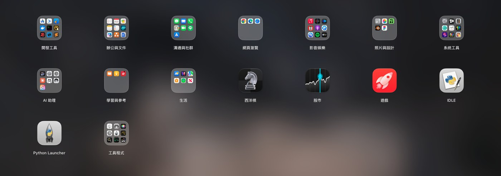
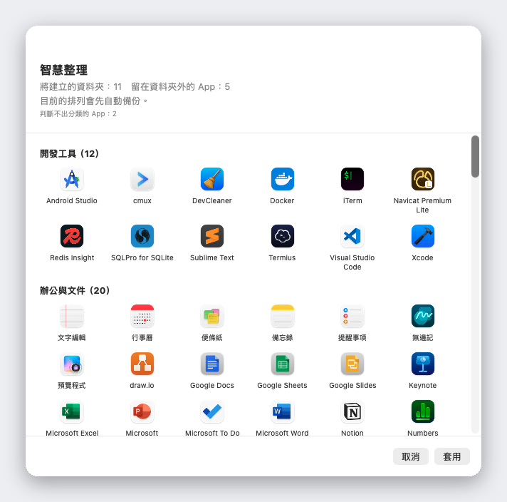

<div align="center">


# Liftoff

**macOS 26 拿掉的啟動台，現在回來了：更快，還多了即時視窗預覽。**

[](../LICENSE)


[](https://github.com/firstfu/Liftoff/releases/latest)


<a href="https://github.com/firstfu/Liftoff/releases/latest"><b>下載 Liftoff.zip</b></a>
&nbsp;·&nbsp;
<code>brew install --cask firstfu/tap/liftoff</code>

[English](../README.md) · **繁體中文** · [简体中文](README.zh-Hans.md) · [日本語](README.ja.md) · [한국어](README.ko.md) · [Deutsch](README.de.md) · [Français](README.fr.md) · [Español](README.es.md) · [Português](README.pt-BR.md) · [Italiano](README.it.md) · [Русский](README.ru.md) · [Türkçe](README.tr.md) · [Nederlands](README.nl.md)


</div>

> [!NOTE]
> Liftoff 需要 **macOS 26 或以上版本**。它**還沒有經過 Apple 公證**，所以 macOS 會擋下第一次開啟：請打開「系統設定 → 隱私權與安全性」，按一次 **強制打開**（[步驟](#安裝)）。所有程式碼都公開在這裡，[各項權限分別用在哪裡](#權限一覽)也寫在下面。

## 為什麼要做 Liftoff

macOS 26 把經典的啟動台格線換成了「App」清單。如果你和我一樣習慣那個格線：分頁、資料夾、拖曳排列、打字即搜尋，Liftoff 就是為你做的。它專為 macOS 26 從頭打造，並嚴守效能底線：開啟不到 3 ms、翻頁絕不掉幀、閒置時 CPU 使用率 0%。

然後，它再加上原版從來沒有的功能。



## 功能

### 即時視窗預覽

把游標停在執行中的 App 上（或對它按<kbd>空白鍵</kbd>），它的視窗就會以縮圖顯示。點一下縮圖，直接切到那個視窗，最小化的視窗和其他桌面上的視窗也行。


### App 和視窗一次找齊的搜尋

打幾個字就好。Liftoff 會比對 App 名稱、縮寫（`vsc` → Visual Studio Code）、中文名稱的拼音，以及你已開啟視窗的標題。


### 智慧整理

一鍵把你所有的 App 分進合理的資料夾：開發工具、文件與辦公、媒體、工具程式……套用前會先給你完整預覽，按下「套用」之前什麼都不會變，目前的排列也會自動備份。

它靠的是內建、收錄 1,000 多款熱門 Mac App 的對照表（包含在中國、日本、韓國與台灣常用的 App），不是靠猜：沒有 AI、不連網，每次結果都一樣。少了哪個 App？在 [`AppCategories.json`](../Liftoff/Resources/AppCategories.json) 加一行就好，歡迎發 pull request。



### 還有更多

- **直接從格線把 App 拖進 Dock**，啟動台會自動讓開
- **匯入舊的啟動台排列**，或用智慧整理重新開始
- 開啟方式隨你挑：快速鍵（預設 <kbd>⌃⌘L</kbd>）、拇指加三指捏合、熱點、Dock 圖示，或 `open liftoff://toggle`
- 分頁、資料夾（拖曳合併）、拖曳排序、鍵盤操作
- 模糊桌布（最省電）、即時模糊或自選圖片；圖示大小、標籤大小與顏色都能調整
- 支援多螢幕 · 可隱藏 App · 解除安裝 App 並清除殘留檔案 · 備份與還原排列
- 支援 13 種語言，跟隨系統語言


## 效能

由 App 自己在真實的 Mac 上量測（在你的 Mac 上執行 `scripts/selftest.sh` 即可重現這些數字）：

| | |
|---|---|
| 開啟面板 | **< 3 ms** |
| 搜尋，每次按鍵 | **< 8 ms** |
| 翻頁 | **0 掉幀** |
| 閒置 | **0% CPU** |

## 隱私

Liftoff **不會連網**，除非你要求它檢查更新。視窗縮圖只在你的 Mac 上擷取與顯示，不會離開你的電腦。
它唯一可能發出的連線就是檢查更新：向 GitHub API 發出一次請求，讀取最新的版本號，而且只有在你按下 **檢查更新…**，或在設定中開啟 **每週自動檢查更新**（預設關閉）時才會發出。不會傳送任何關於你的資料。

不必只聽我說：用到各項權限的程式碼都在這裡，[`Liftoff/Preview`](../Liftoff/Preview)（螢幕與系統錄音：縮圖；輔助使用：列出與切換視窗）和 [`Liftoff/Services`](../Liftoff/Services)（快速鍵、熱點、觸控式軌跡板手勢，以及 `UpdateChecker.swift` 裡的檢查更新）。用 Little Snitch 或 LuLu 也能確認。

### 關於私有 API

有兩項功能用到未公開的 macOS API，都是動態載入並附有 fallback：如果這些符號消失，該功能會自動關閉，而不是當掉。

- [`Liftoff/Preview/PrivateAPI.swift`](../Liftoff/Preview/PrivateAPI.swift)：SkyLight / HIServices，用於列舉與切換視窗（做法與 AltTab、Hammerspoon 相同）
- [`Liftoff/Services/TrackpadGesture.swift`](../Liftoff/Services/TrackpadGesture.swift)：MultitouchSupport，用於捏合手勢（做法與 BetterTouchTool、MiddleClick 相同）

## 安裝

**Homebrew**: `brew install --cask firstfu/tap/liftoff` (`brew upgrade --cask liftoff`)

1. 從 [Releases](https://github.com/firstfu/Liftoff/releases/latest) 下載 `Liftoff.zip` 並解壓縮。
2. 把 `Liftoff.app` 移到 `/Applications`。
3. 打開它。第一次開啟時 macOS 會擋下，因為它還沒有經過 Apple 公證：請打開 **系統設定 → 隱私權與安全性**，往下捲動，在「已阻擋「Liftoff」以保護你的Mac。」旁邊按下 **強制打開**。
4. 依提示授予權限：**輔助使用**（列出與切換視窗）和 **螢幕與系統錄音**（視窗縮圖，只在本機處理）。

需要 **macOS 26 或以上版本**，支援 Apple 晶片與 Intel。

### 更新

用新的 `Liftoff.app` 取代 `/Applications` 裡的舊版。這些建置版本採用 ad-hoc 簽章，macOS 會把每個版本當成新的 App：你要再按一次 **強制打開**，並重新開啟螢幕與系統錄音和輔助使用的權限（如果開關看起來是開的卻沒作用，請用 **－** 把 Liftoff 從清單移除，再重新加入）。
想知道有沒有新版本：在選單列選單或設定中選擇 **檢查更新…**、在設定中開啟 **每週自動檢查更新**（預設關閉），或在本頁使用 **Watch → Custom → Releases**。

## 權限一覽

| 權限 | 需要嗎？ | 用途 | 不授予的話 |
|---|---|---|---|
| **螢幕與系統錄音** | 只有視窗預覽需要 | 視窗縮圖與標題（只在你的 Mac 上擷取與顯示） | 沒有視窗預覽；Liftoff 仍然是個啟動台 |
| **輔助使用** | 選用 | 列出最小化的視窗，並精準跳到你點的那個視窗 | 不會列出最小化的視窗；切換比較不精準 |

不會再要求其他權限。啟動台本身完全不需要任何權限。

## 常見問題

<details>
<summary><b>macOS 說「已阻擋「Liftoff」以保護你的Mac」</b></summary>

Liftoff 還沒有經過 Apple 公證。請打開「系統設定 → 隱私權與安全性」，往下捲動，在該訊息旁按下 **強制打開**。每個版本只需要做一次。
</details>

<details>
<summary><b>視窗預覽沒有出現，或沒有縮圖</b></summary>

請確認在「系統設定 → 隱私權與安全性」裡，**螢幕與系統錄音**（預覽需要）和選用的 **輔助使用**（最小化的視窗、精準切換）都已為 Liftoff 開啟。如果開關看起來是開的卻沒作用（更新後很常見），請用 **－** 把 Liftoff 從清單移除，再重新加入。如果清單裡根本沒有 Liftoff（macOS 不一定會自動加入），請按清單下方的 **＋**，到「應用程式」選 Liftoff。
</details>

<details>
<summary><b>更新後權限會不見嗎？</b></summary>

會，ad-hoc 簽章的發行版就是如此：macOS 把每個版本當成新的 App，所以螢幕與系統錄音和輔助使用都要重新允許。用你自己的憑證自行建置就能避免，請參閱 [`Config/Signing.xcconfig`](../Config/Signing.xcconfig)。
</details>

<details>
<summary><b>快速鍵、捏合手勢或熱點打不開它</b></summary>

可能是別的 App 已經占用了那組快速鍵（設定 → 觸發方式會顯示警告），請換一組。捏合手勢會在 Liftoff 執行期間，暫時關閉 macOS 自己用來開「App」的捏合手勢，並在你關掉它或結束 Liftoff 時還原。`open liftoff://toggle` 一律可用。
</details>

<details>
<summary><b>要怎麼解除安裝？</b></summary>

從選單列結束 Liftoff，把 `Liftoff.app` 從 `/Applications` 刪除；如果你啟用過「在登入時打開」，也請到「系統設定 → 一般 → 登入項目」把它移除。若要連設定一起清掉：執行 `defaults delete com.firstfu.Liftoff`，並刪除 `~/Library/Caches/com.firstfu.Liftoff`。
</details>

## 與類似工具的差異

[LaunchNext](https://github.com/RoversX/LaunchNext) 是個不錯、持續維護的開源專案：它有公證、能匯入舊的啟動台排列，也有模糊搜尋和資料夾。如果那正是你需要的，就用它。Liftoff 多出來的是：執行中 App 的視窗即時縮圖（點一下就跳過去，最小化的也行）、連視窗標題都能比對的搜尋、一鍵智慧整理（內建對照表、不用 AI、套用前先預覽）、從格線把 App 拖進 Dock，以及可以自己重現的效能數字。目前的取捨是：LaunchNext 有公證，Liftoff 還沒有。

## 語言

Liftoff 跟隨系統語言：English、繁體中文、简体中文、日本語、한국어、Deutsch、Français、Español、Português (Brasil)、Italiano、Русский、Türkçe 和 Nederlands。其他語言會改用英文。

發現不通順的翻譯，或想新增語言？所有介面文字都在同一個檔案 [`Liftoff/Resources/Localizable.xcstrings`](../Liftoff/Resources/Localizable.xcstrings)，用 Xcode 打開就能改，也歡迎發 pull request。

## 從原始碼建置

需要 Xcode 26 和 [XcodeGen](https://github.com/yonaskolb/XcodeGen)（`brew install xcodegen`）。

```sh
git clone https://github.com/firstfu/Liftoff.git && cd Liftoff
xcodegen generate
xcodebuild -project Liftoff.xcodeproj -scheme Liftoff -configuration Release -derivedDataPath build build
open build/Build/Products/Release/Liftoff.app
```

不需要 Apple 帳號，預設為 ad-hoc 簽章。若要用自己的憑證簽署（讓 macOS 在重新建置後仍保留輔助使用與螢幕與系統錄音的權限），請參閱 [`Config/Signing.xcconfig`](../Config/Signing.xcconfig)。
測試：把 `xcodebuild` 指令中的 `build` 換成 `test`。`scripts/install.sh` 會建置 Release、安裝到 `/Applications` 並設定開機自動啟動。

## 參與貢獻

免費、開源，由一個人開發，非常歡迎 [issue](https://github.com/firstfu/Liftoff/issues/new/choose) 與 pull request。最容易幫上忙的方式：修正翻譯、把缺少的 App 補進 [`AppCategories.json`](../Liftoff/Resources/AppCategories.json)，或回報 bug 時附上你的 macOS 版本。

## 授權

[GPLv3](../LICENSE)。你可以自由使用、研究、修改與分享；你散布的修改版本必須以相同授權保持開源。
